[论文地址](https://arxiv.org/abs/1711.09224)  
[代码地址](https://github.com/ShichenLiu/CondenseNet)

## 简介  

&emsp;&emsp;

## 相关工作  

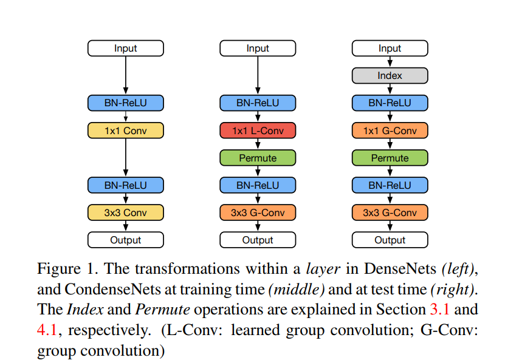
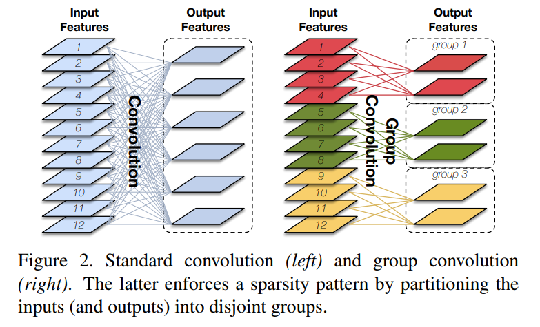

&emsp;&emsp;

## CondenseNets  

&emsp;&emsp;在DenseNet的基础上使用1x1的分组卷积效果不好，作者认为这是由使用前面的特征图与当前特征图合并做输入引起的。这与典型的卷积输入有两点不同：1.它们有固定的秩序，2.它们更加多样化。不相关组的特征分配会妨碍特征在网络的再利用。作者对输入的特征图进行随机置换减小了对准确性的负面影响，但在相同的计算成本下比smaller DenseNets准确率低。  
&emsp;&emsp;在DenseNet中已经证明：将早期的特征作为后期层的输入对特征重用是十分有效的。但是并不是所有的早期特征对随后的层有影响，很难预测哪些特征应该被使用。为了解决这个问题，我们提出了一种在训练中自动学习输入特征分组的方法。学习组结构允许每个滤波器选择它自己最相关的一组输入。  
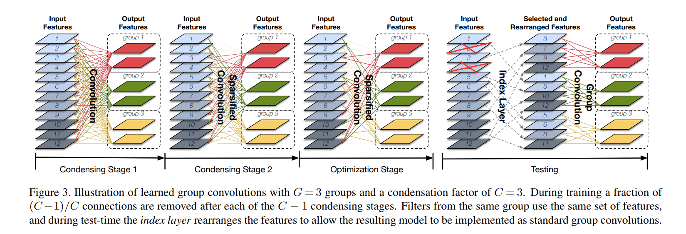  

## 学习组卷积  

&emsp;&emsp;我们通过多阶段过程学习组卷积，如图3和图4所示。训练迭代的前半部分包括压缩阶段。在这里，我们重复训练网络，稀疏诱导正则化，进行固定次数的迭代，然后修剪掉具有权重比较低的不重要滤波器。培训的后半部分包括优化阶段，我们在分组修复后学习过滤器。执行修剪时，我们确保来自同一组的过滤器共享相同的稀疏模式。结果，一旦训练完成（测试阶段），可以使用标准组卷积来实现稀疏化层。由于组卷积由许多深度学习库有效实现，因此在理论上和实践中都可以节省大量计算量。我们将在下面介绍我们的方法。  

### 滤波器分组  

&emsp;&emsp;卷积过程用4D张量$O\times R\times W\times H$表示，其中O表示输出通道数，R表示输入通道数，W和H表示滤波器的长宽。训练前将滤波器分为相同大小的G组，$F_{ij}^{g}$表示组g内第i个输出的第j个输入的权重。  

### 压缩标准  

&emsp;&emsp;在训练过程中，筛选出没组中不重要的输入特征的子集。第j个输入特征的对于滤波器组g的重要性通过它在组内所有输出之间的权重的平均值来评估，即$\sum_{i=1}^{O/G}{|F_{ij}^{g}|}$，换句话说，如果它们的L1范数比其他列的L1范数小，则我们删除$F^{g}$中的列（通过将它们归零）。这使卷积层在结构上稀疏：来自同一组的滤波器总是接收与相同的特征输入。  

### Group Lasso  

&emsp;&emsp;为减少权重修剪带来的负面影响，L1正则化通常用来诱导稀疏性。为了是同一组滤波器有相同的稀疏输入，我们使用以下的组稀疏性计算方法：
$$\sum_{g=1}^{G}\sum_{j=1}^{R}\sqrt{\sum_{i=1}^{O/G}{F_{ij}^{g}}^2}$$
&emsp;&emsp;组正则化将$F_{g}$中所有的元素置为0，因为平方根中的项由该列中的最大元素控制。这会使模型向组水平的稀疏方面发展。  

### 压缩因子  

&emsp;&emsp;除了学习组卷积能够自动发现良好的连接模式之外，它们还比标准组卷积更灵活。 特别是，组使用的特征图的比例不一定需要是1/G。 我们定义了一个可能与G不同的凝聚因子C，并允许每个组选择输入的R/C。  

### 压缩步骤

&emsp;&emsp;与在预训练网络中修剪权重的方法相比，我们的权重修剪过程被整合到训练过程中。 如图3所示（使用C = 3），在每个C-1压缩阶段结束时，我们修剪滤波器权重的1/C。 在训练结束时，每个滤波器组中仅保留1/C的权重。 在我们的所有实验中，我们将凝聚阶段的训练时期的数量设置为$M/2(c-1)$，其中M表示训练时期的总数 ，使得训练时期的前半部分用于压缩。 在训练过程的后半部分，优化阶段，我们训练了稀疏模型。（实际操作中将剪掉的分支置为0）。

### 学习率

&emsp;&emsp;
我们采用Loshchilov等人的余弦形状学习率表。它可以平滑地退化学习率，并且通常可以提高准确度。 图4将学习率显示为训练时期（品红色）的函数，以及在CIFAR-10数据集上训练的CondenseNet的相应训练损失（蓝色曲线）。在时期150处的损失的突然增加是由最终的冷凝操作引起的，其消除了剩余重量的一半。 然而，该图显示该模型在优化阶段从该修剪步骤逐渐恢复。
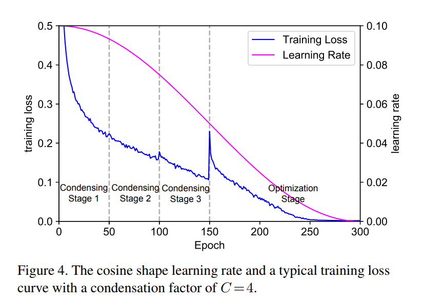  

### 索引层  

&emsp;&emsp;在训练完成后，我们移除修剪的权重并将稀疏模型转化为具有常规模式的网络，在图三的测试步骤中可以看到索引层。索引层在输入滤波器重新排列进行输出，以便于现有的常规组卷积的实现。图1显示了训练期间（中间）和测试期间（右侧）CondenseNet层的转换。 在训练期间，1×1卷积是学习组卷积（L-Conv），但在测试期间，在索引层的帮助下，它变为标准组卷积（G-Conv）。

## 网络设计  

&emsp;&emsp;除了使用上面介绍的学习组卷积之外，我们还对常规DenseNet架构进行了两处更改。这些更改旨在进一步简化体系结构并提高其计算效率。图5说明了我们对DenseNet架构所做的两项更改。
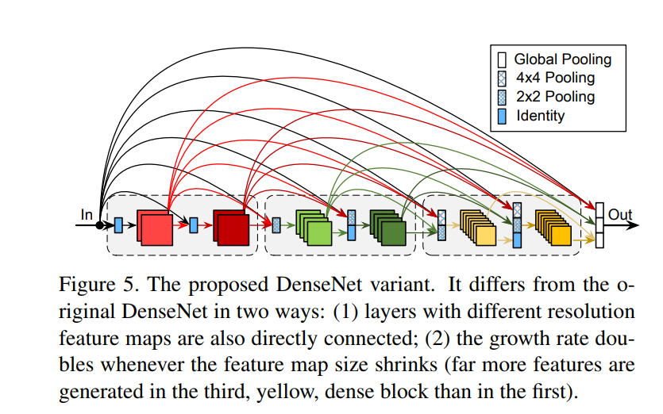  

### 增长增长率  

&emsp;&emsp;原始的DenseNet设计每层增加$k$个特征图，表示增长率。在DenseNet中，较深的层更依赖于高水平的特征而不是低水平的特征，这激励我们提高网络的捷径连接。我们发现可以通过随深度增长而提高增长率来实现。这增加了后期层相对于前面层的比率。将增长率变化设置为$k=2^{m-1}k_{0}$，其中m是密集块的索引，k0是常量。 这种设定增长率的方式不会引入任何额外的超参数。 “增长增长率”（IGR）策略在模型的后续层中放置了更大比例的参数。 这大大提高了计算效率，但在某些情况下可能会降低参数效率。根据具体的硬件限制而定。

### 完全密集连接

&emsp;&emsp;为了鼓励功能重用，甚至比原来的DenseNet架构更多，我们将输入层连接到网络中的所有后续层，即使这些层位于不同的密集块中（参见图5）。由于密集块具有不同的特征分辨率，因此当我们使用平均池作为低分辨率层的输入时，我们对具有更高分辨率的特征映射进行下采样。
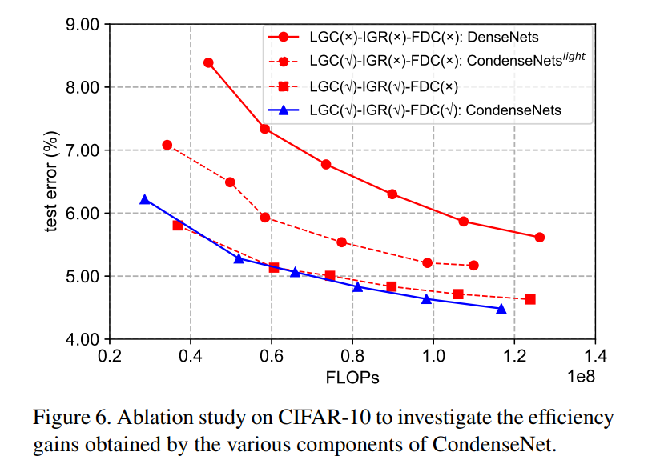
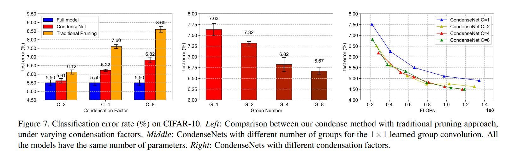
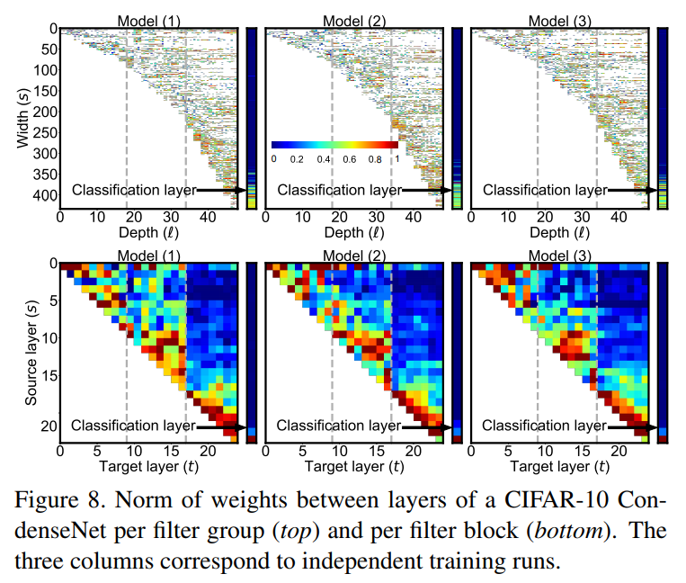

### 实验  

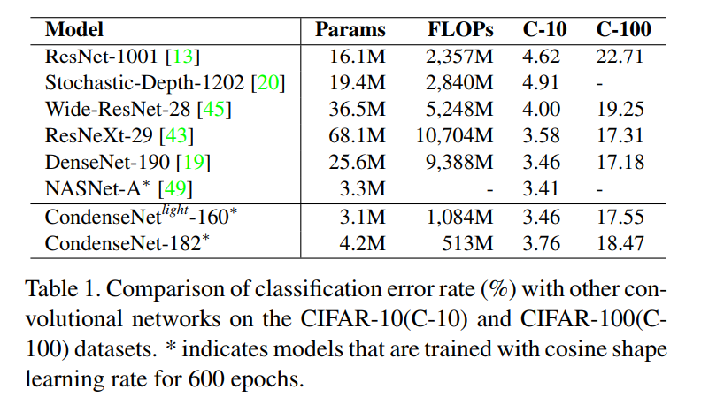
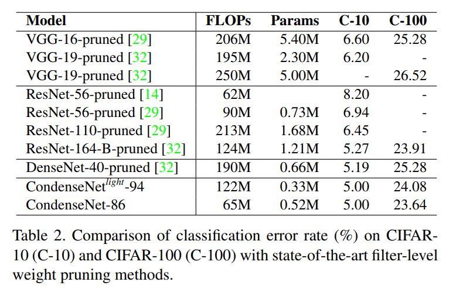
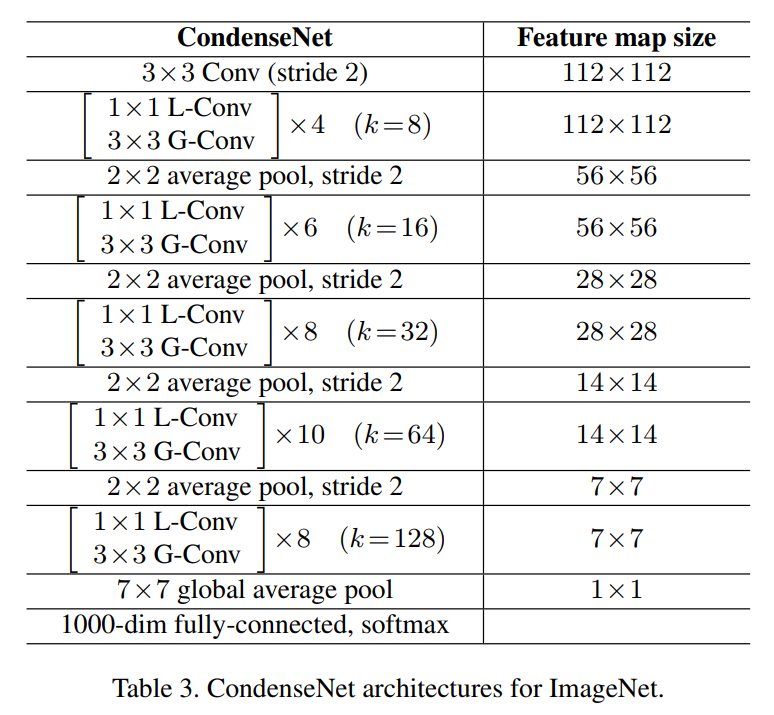
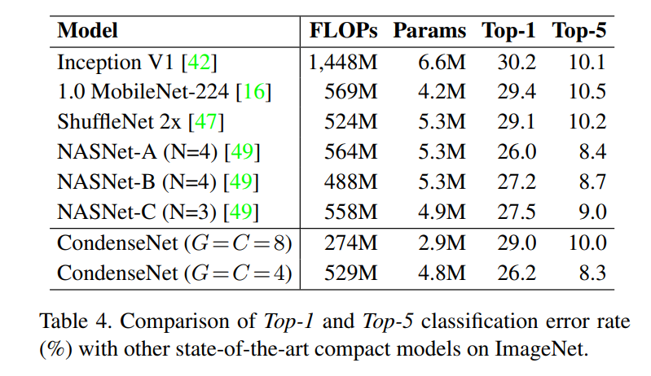
&emsp;&emsp;