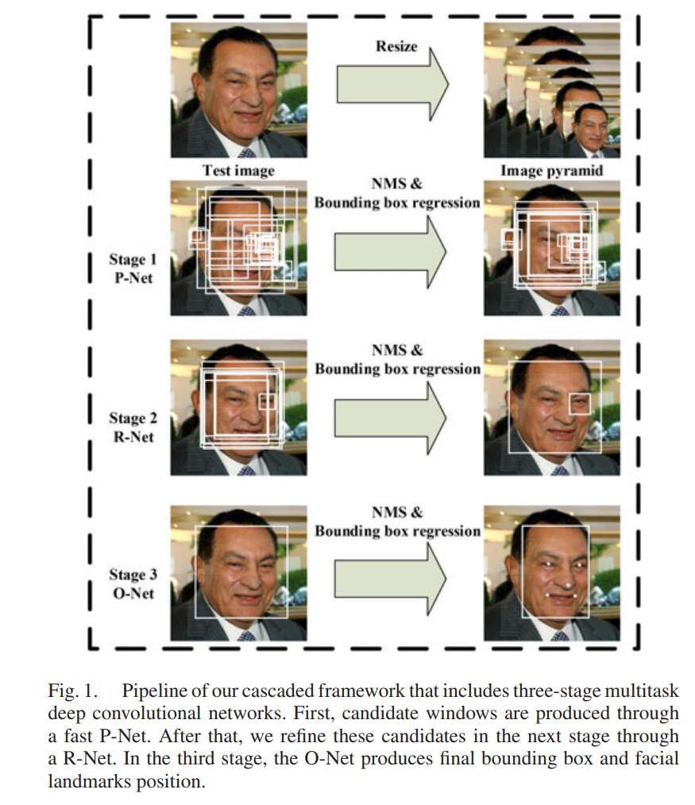

[论文地址](https://arxiv.org/pdf/1604.02878)

## 摘要  

&emsp;&emsp;由于各种姿势，照明和遮挡，无约束环境中的人脸检测和对齐具有挑战性。最近的研究表明，深度学习方法可以在这两项任务上取得好的表现。在本文中，我们提出了一个深度级联多任务框架，它利用检测和对齐之间的内在联系来提高其性能。特别是，我们的框架利用级联架构，通过三个阶段精心设计的深度卷积网络，以粗略到精细的方式预测面部和地标位置。此外，我们提出了一种新的在线硬样本挖掘策略，可进一步提高实践中的性能。我们的方法在具有挑战性的人脸检测数据集和基准测试和WIDER FACE人脸检测基准测试方面取得了最先进的技术，并在面部对齐的野外基准测试中注释了面部标志，同时保持了实时性能。

## 简介

&emsp;&emsp;面部检测和对齐对于许多面部应用至关重要，例如面部识别和面部表情分析。然而，面部的大的视觉变化，例如遮挡，大的姿势变化和极端的照明，对于实际应用中的这些任务提出了巨大的挑战。  
&emsp;&emsp;Viola和Jones提出的级联人脸检测器利用Haar-Like特征和AdaBoost训练级联分类器，实现了良好的性能和实时效率。但是，相当一部分工作表明，这种检测在实际应用中面对剧烈视觉变化的人脸时会显著减低表现，即使有高级的特征和分类器。基于级联结构，
Mathias等人引入了用于人脸检测的可变形零件模型，并实现了卓越的性能。然而，它们在计算上是昂贵的并且通常在训练阶段需要大量的注释。最近，卷积神经网络（CNN）在各种计算机视觉任务中取得了显着进步，例如图像分类和人脸识别。受到计算机视觉任务中深度学习方法的重大成功的启发，一些研究利用深度CNN进行人脸检测。杨等人训练深层CNN进行面部属性识别，以获得面部区域的高响应，进一步产生面部候选窗口。然而，由于其复杂的CNN结构，这种方法在实践中耗时。李等人使用级联CNN进行人脸检测，但它需要从面部检测中进行边界框校准，并且需要额外的计算费用，并忽略了面部标志定位和边界框回归之间的内在相关性。  
&emsp;&emsp;面部对齐也吸引了广泛的研究兴趣。该领域的研究工作大致可分为两类，基于回归的方法和模板拟合方法。最近，张等人提出使用面部属性识别作为辅助任务，以使用深CNN增强面部对齐性能。  
&emsp;&emsp;然而，大多数先前的面部检测和面部对齐方法忽略了这两个任务之间的固有相关性。虽然现有的几个作品试图共同解决它们，但这些作品仍然存在局限性。例如，陈等人利用像素值差异的特征，与随机森林联合进行对齐和检测。但是，这些手工功能限制了它的性能。张等人使用多任务CNN来提高多视图人脸检测的准确性，但检测召回受到弱脸检测器产生的初始检测窗口的限制。
&emsp;&emsp;另一方面，在训练中挖掘硬样品对于增强探测器的功率至关重要。然而，传统的硬样本挖掘通常以离线方式执行，这显着增加了手动操作。期望设计一种用于面部检测的在线硬样本挖掘方法，其自动适应当前训练状态。
&emsp;&emsp;在这封信中，我们提出了一个新的框架，通过多任务学习使用统一的级联CNN来集成这两个任务。拟议的CNN包括三个阶段。在第一阶段，它通过浅CNN快速生成候选窗口。然后，它通过更复杂的CNN拒绝大量非面部窗口来细化窗口。最后，它使用更强大的CNN再次细化结果并输出五个面部标志位置。由于这个多任务学习框架，算法的性能可以显着提高。本函的主要贡献概括如下：

* (1) 我们提出了一种新的级联CNNs框架，用于联合面部检测和对齐，并精心设计轻量级CNN架构以实现实时性能。

* (2) 我们提出了一种有效的方法来进行在线硬样本挖掘，以提高性能。  

* (3) 在具有挑战性的基准测试中进行了广泛的实验，以显示与人脸检测和面部对齐任务中的最新技术相比所提出的方法的显着性能改进。  

## 方法

  

### 总体框架

&emsp;&emsp;

### CNN结构

&emsp;&emsp;

### 训练

&emsp;&emsp;

## 实验

&emsp;&emsp;

