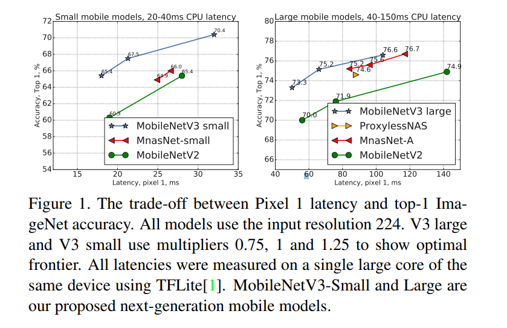
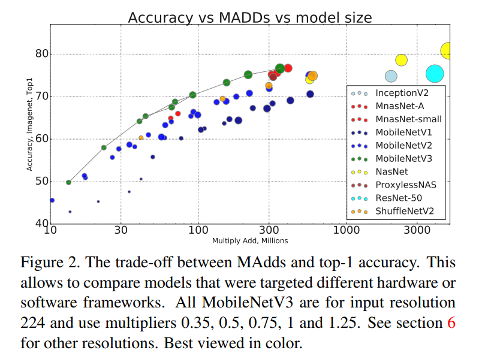
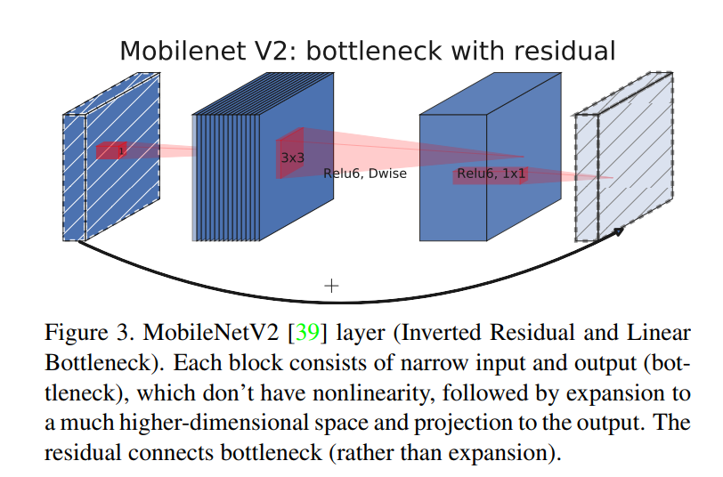
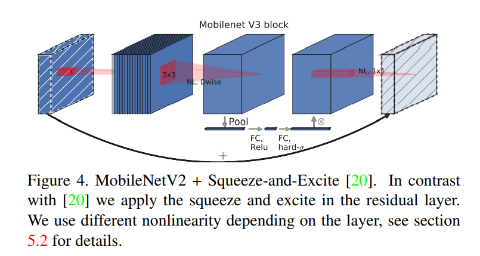

[论文地址](https://arxiv.org/pdf/1905.02244.pdf)

## 摘要

&emsp;&emsp;我们基于互补搜索技术的组合以及新颖的架构设计呈现下一代MobileNets。MobileNetV3通过硬件网络架构搜索（NAS）与NetAdapt算法相结合的方式调整到移动电话CPU，然后通过新颖的架构改进进行改进。本文开始探索自动搜索算法和网络设计如何协同工作，以利用互补的方法来改善整体的现状。通过这个过程，我们为发布创建了两个新的MobileNet模型：MobileNetV3-Large和MobileNetV3-Small，它们针对高资源和低资源使用情况。然后，这些模型被适应并应用于对象检测和语义分割的任务。对于语义分割（或任何密集像素预测）的任务，我们提出了一种新的有效分割解码器Lite Reduced Atrous Spatial Pyramid Pooling（LR-ASPP）。我们实现了移动分类，检测和分割的最新技术成果。MobileNetV3-Large在ImageNet分类上的准确度提高了3.2％，与MobileNetV2相比，延迟降低了15％。与MobileNetV2相比，MobileNetV3-Small的准确度提高了4.6％，同时将延迟降低了5％。MobileNetV3-大检测速度提高了25％，与COCO检测时的MobileNetV2大致相同。MobileNetV3-Large LR-ASPP比MobileNetV2 R-ASPP快30％，与Cityscapes细分的准确度相似。

## 简介

&emsp;&emsp;高效的神经网络在移动应用程序中变得无处不在，从而实现全新的设备体验。它们也是个人隐私的关键推动因素，允许用户获得神经网络的好处，而无需将数据发送到服务器进行评估。神经网络效率的进步不仅可以通过更高的准确性和更低的延迟来改善用户体验，还可以通过降低功耗来帮助延长电池寿命。  
&emsp;&emsp;本文描述了我们开发MobileNetV3大型和小型模型的方法，以便提供下一代高精度高效神经网络模型，为设备上的计算机视觉提供动力。新网络推动了最新技术的发展，并演示了如何将自动搜索与新颖的架构改进相结合，以构建有效的模型。  
&emsp;&emsp;本文的目标是开发最佳的移动计算机视觉架构，优化移动设备上的准确度。为实现这一目标，我们引入了（1）互补搜索技术，（2）适用于移动设置的非线性高效新版本，（3）新的高效网络设计,（4）新的有效分段解码器。我们提供了彻底的实验，证明了在各种用例和手机上评估的每项技术的功效和价值。  
&emsp;&emsp;本文的结构如下。我们首先讨论第2节中的相关工作。第3节回顾了用于移动模型的有效构建块。第4节回顾了体系结构搜索以及MnasNet和NetAdapt算法的互补性。第5节描述了新颖的架构设计，提高了通过联合搜索找到的模型的效率。第6节介绍了分类，检测和分割的广泛实验，以便证明有效性并理解不同元素的贡献。第7节包含结论和未来的工作。

## 相关工作

&emsp;&emsp;近年来，设计深度神经网络架构以实现精度和效率之间的最佳平衡是一个活跃的研究领域。新颖的手工结构和算法神经结构搜索都在推动这一领域发挥了重要作用。  
&emsp;&emsp;SqueezeNet[22]广泛使用1x1卷积，挤压和扩展模块主要集中在减少参数数量上。最近的工作将重点从减少参数转移到减少操作数（MAdds）和实际测量的延迟。MobileNetV1[19]采用深度可分离卷积来大幅提高计算效率。MobileNetV2[39]通过引入具有反向残差和线性瓶颈的资源有效块来扩展这一点。ShuffleNet[49]利用组卷积和信道混洗操作来进一步减少MAdds。CondenseNet[21]在训练阶段学习群组卷积，以保持层之间有用的密集连接，以便重新使用特征。ShiftNet[46]提出了与逐点卷积交织的移位操作，以取代昂贵的空间卷积。  
&emsp;&emsp;为了使架构设计过程自动化，首先引入强化学习（RL）来搜索具有竞争精度的高效架构[53,54,3,27,35]。完全可配置的搜索空间可以呈指数级增长并且难以处理。因此，架构搜索的早期工作集中在单元级结构搜索上，并且在所有层中重用相同的单元。最近，[43]探索了一种块级分层搜索空间，允许在网络的不同分辨率块处使用不同的层结构。为了降低搜索的计算成本，在[28,5,45]中使用可分的架构搜索框架，使用基于梯度的优化。着眼于将现有网络适应受约束的移动平台，[48,15,12]提出了更有效的自动网络简化算法。  
&emsp;&emsp;量化[23,25,47,41,51,52,37]是通过降低精度算法来提高网络效率的另一个重要的补充努力。最后，知识蒸馏[4,17]提供了一种额外的补充方法，可以在大型“教师”网络的指导下生成小型精确的“学生”网络。  

## 高效的移动构建模块

&emsp;&emsp;移动模型建立在越来越高效的构建块上。MobileNetV1[19]引入了深度可分离卷积作为传统卷积层的有效替代。深度可分离卷积通过将空间滤波与特征生成机制分离来有效地分解传统卷积。深度可分离卷积由两个单独的层定义：用于空间滤波的轻重量深度卷积和用于特征生成的较重的1x1逐点卷积。  
&emsp;&emsp;MobileNetV2[39]引入了线性瓶颈和倒置残差结构，以通过利用问题的低等级性质来制造更高效的层结构。该结构如图3所示，由1x1扩展卷积后跟深度卷积和1x1投影层定义。当且仅当它们具有相同数量的通道时，输入和输出才与剩余连接相连。这种结构在输入和输出处保持紧凑的表示，同时在内部扩展到更高维的特征空间，以增加非线性每通道变换的表现力。  

&emsp;&emsp;MnasNet[43]基于MobileNetV2结构，将基于压缩和激发的轻量级注意模块引入瓶颈结构。请注意，压缩和激励模块集成在与[20]中提出的基于ResNet的模块不同的位置。模块放置在扩展中的深度滤波器之后，以便将注意力应用于最大的表示，如图4所示。  

&emsp;&emsp;对于MobileNetV3，我们使用这些层的组合作为构建块，以便构建最有效的模型。层也升级了修改的swish非线性[36,13,16]。压缩和激励以及swish非线性都使用了sigmoid，这可能是低效的计算以及在定点算术中保持精度的挑战，所以我们用hard sigmoid[2,11]代替它，如5.2节所述。  

## 网络搜索

&emsp;&emsp;网络搜索已经证明它是发现和优化网络架构的一个非常强大的工具[53,53,5,48]。对于MobileNetV3，我们使用平台感知NAS通过优化每个网络块来搜索全局网络结构。然后，我们使用NetAdapt算法在每层中搜索过滤器的数量。这些技术是互补的，可以组合起来有效地找到给定硬件平台的优化模型。  

### 用于分块搜索的平台遥感NAS

&emsp;&emsp;