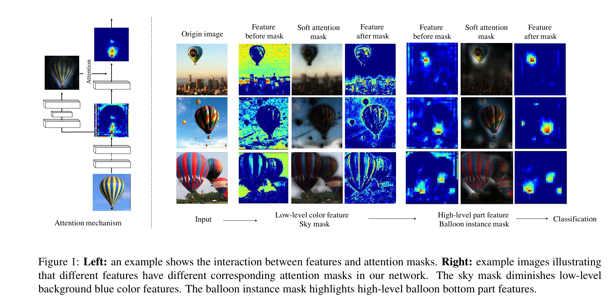

[论文地址](https://arxiv.org/pdf/1704.06904)  

## 摘要  

&emsp;&emsp;在这个工作中，我们提出了“残差注意网络”，它是一种使用注意力机制的卷积神经网络，能够将最先进的前馈神经网络机制融合到端对端的训练中。我们的残差注意网络是由生成注意力感知特征的注意力模块堆叠而成的。注意力感知特征会随着层数的加深自适应地改变。在每个注意力模块的内部，自上而下自下而上的前馈结构能够将前馈和反馈结构展开到单个的前馈过程中。重要的事，我们提出的注意力残差学习非常深的残差注意网络，能够轻松地扩展到数百层。  
&emsp;&emsp;我们对CIFAR-10和CIFAR-100数据集进行了广泛的分析，以验证上述每个模块的有效性。我们的剩余注意力网络在三个基准数据集上实现了最先进的物体识别性能，包括CIFAR-10（3.90％误差），CIFAR-100（20.45％误差）和ImageNet（4.8％单一模型和单一作物，顶部 - 5错误）。请注意，与ResNet-200相比，我们的方法实现了0.6％的前1精度提升，46％的主干深度和69％的前向FLOP。该实验还表明，我们的网络可以抵御嘈杂的标签。  

## 1 介绍  

&emsp;&emsp;不止是友好的脸，而且红色也会引起我们的注意。在之前的文献中已经广泛地研究了混合特征。注意力不仅服务于选择聚焦位置，而且鼓励该位置处目标的不同表示。之前的工作将注意力漂移作为一个序列过程来捕捉不同的参与方面。然而，据我们所知，在图像分类任务没有注意力机制中被应用于前馈网络结构来实现最先进的结果。最近在图像分类任务的先进工作都是致力于使用非常深的结构训练前馈神经网络。  
&emsp;&emsp;受到注意力机制和深度神经网络进步的鼓舞，我们提出了残差注意力网络(RAN)，一种使用混合注意力机制的非常深的结构。RAN是由多个能够生成注意力感知特征的注意力模块组成。随着层数的加深，来自不同模块的注意力特征会自适应地改变。  
&emsp;&emsp;除了注意力机制带来的更具辨别力的特征表示外，我们的模型还具有以下吸引人的特性：
（1）增加注意力模块导致模型能力提升，因为不同种类的注意力被广泛地捕获。图一显示了在热气球图片上不同种类注意力。天空注意力掩膜虚化了背景表现，气球底部的注意力掩膜突出了气球的底部。  
  
（2）它使得端对端的训练方式可以融入到最先进的深度网络结构中。特别地，我们的网络可以扩展到数百层。我们的残留注意网络在CIFAR-10，CIFAR-100和具有挑战性的ImageNet图像分类数据集上超越了最先进的残留网络，显着减少了计算（69％前向FLOP）。  
&emsp;&emsp;所有上述方法可以通过以下方法实现：
（1）堆叠网络结构：我们的RAN通过堆叠注意力模块组成。堆叠结构是混合注意力机制的基本应用，因此，不同类别的注意力能够被不同的注意力模块捕获。  
（2）注意力残差学习：直接堆叠注意模块会导致明显的性能下降。因此，我们提出了注意力残留学习机制来优化具有数百层的非常深的残留注意网络。  
（3）自上而下自下而上的前馈注意力机制：自上而下自下而上的前馈结构以及成功用于人类行为检测和图像分割。我们使用这种结构作为注意力模块的一部分，用来在功能上添加软权重。这种结构可以在单个前馈过程中模拟自下而上的快速前馈过程和自上而下的注意反馈，这使我们能够自上而下地开发端到端的可训练网络。我们工作中自下而上自上而下的结构与堆叠沙漏网络的不同之处在于其引导特征学习的意图。  

## 2 相关工作  

&emsp;&emsp;来自人类感知过程的证据[23]显示了注意机制的重要性，它使用顶级信息来指导自下而上的前馈过程。 最近，已经尝试将注意力应用于深度神经网络。 Deep Boltzmann Machine（DBM）[21]通过其在训练阶段的重建过程包含自上而下的关注。 注意机制也被广泛应用于递归神经网络（RNN）和长期短期记忆（LSTM）[13]，以解决顺序决策任务[25,29,21,18]。按顺序收集信息并决定下个特征学习步骤的关注内容。  
&emsp;&emsp;残差学习致力于学习身份映射间的残差。 该技术极大地增加了前馈神经网络的深度。 与我们的工作类似，[25,29,21,18]使用残余学习和注意机制来从残余学习中受益。 使用注意机制捕获两个信息源（查询和查询上下文）以在他们的工作中互相帮助。 在我们的工作中，单个信息源（图像）被分成两个不同的信息源并重复组合。 并且应用残差学习来缓解重复分裂和组合带来的问题。  
&emsp;&emsp;在图像分类中，使用不同的方法应用自上而下的注意机制：顺序过程，区域建议和控制门。 顺序过程[23,12,37,7]将图像分类建模为顺序决策。 因此，可以类似地应用以上注意力。 该公式允许使用RNN和LSTM进行端到端优化，并且可以以目标驱动的方式捕获不同类型的注意力。  
&emsp;&emsp;区域提案[26,4,8,38]已成功应用于图像检测任务。 在图像分类中，在前馈分类之前添加附加区域建议阶段。 建议的区域包含最高信息，并在第二阶段用于特征学习。 与区域提案依赖于大量监督的图像检测不同，例如 地面真实边界框或详细的分割掩模[6]，无监督学习[35]通常用于生成图像分类的区域提议。  
&emsp;&emsp;控制门被广泛地用于LSTM中，在注意力图像分类中，用顶层信息更新神经元的控制门，并且在训练期间影响前馈过程[2,30]。 然而，在训练步骤中涉及新过程，强化学习[30]或优化[2]。 Highway Network[29]扩展了控制门，解决了深度卷积神经网络的梯度退化问题。  
&emsp;&emsp;然而，图像分类的最新进展侧重于使用“非常深”结构训练前馈卷积神经网络[27,33,10]。 前馈卷积网络模拟人类皮层的自下而上的路径。 已经提出了各种方法来进一步提高深度卷积神经网络的判别能力。 VGG [27]，Inception [33]和残差学习[10]被提出来训练非常深的神经网络。 随机深度[14]，批量标准化[15]和Dropout [28]利用正则化进行收敛并避免过度拟合和退化。  
&emsp;&emsp;在最近的工作[3,17]中产生的软关注可以对卷积网络进行端到端的训练。 我们的剩余注意力网络以创新的方式将快速发展的前馈网络结构中的软关注融入其中。 最近提出的空间变换器模块[17]实现了关于门牌号识别任务的最新结果。 捕获顶部信息的深度网络模块用于生成仿射变换。 仿射变换应用于输入图像以获得关注区域，然后馈送到另一个深度网络模块。 通过使用可执行空间变换的可微网络层，可以端到端地训练整个过程。 注意尺度[3]使用软注意作为比例选择机制，并在图像分割任务中获得最先进的结果。  
&emsp;&emsp;我们的残留注意网络中软关注结构的设计受到最近开发的定位任务的启发，即分割[22,25,1]和人体姿态估计[24]。 这些任务激励研究人员使用细粒度特征图来探索结构。 框架倾向于级联自下而上和自上而下的结构。 自下而上的前馈结构产生具有强语义信息的低分辨率特征映射。 之后，自上而下的网络产生密集的特征，以推断每个像素。 在底部和顶部特征图之间采用跳过连接[22]，并在图像分割上实现了最先进的结果。 最近堆叠的沙漏网络[24]融合了来自多个尺度的信息，以预测人体姿势，并从编码全局和本地信息中获益。  

## 3 RAN  

&emsp;&emsp;我们的残差注意网络是由叠加注意力模块组成的。每个注意力模块可以分为两个分支：主干分支和掩膜分支。主干分支用于特征提取，并且能够使用任何最先进的网络结构。在这个工作中，我们使用预激活的残差单元ResNeXt和Inception作为我们RAN网络的基础单元来组成注意力模块。