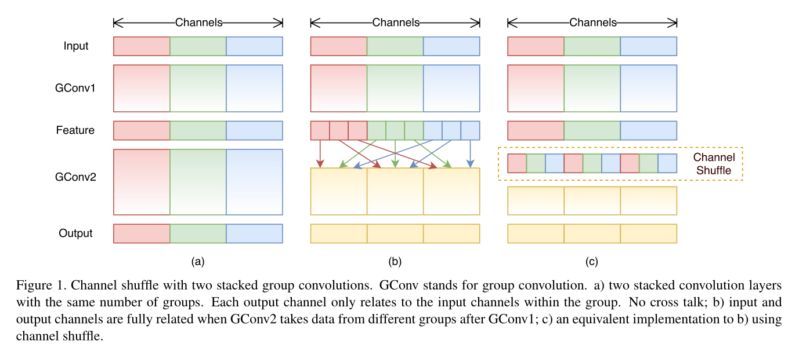
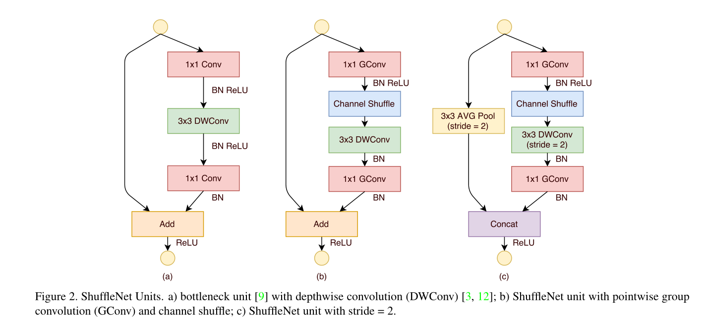
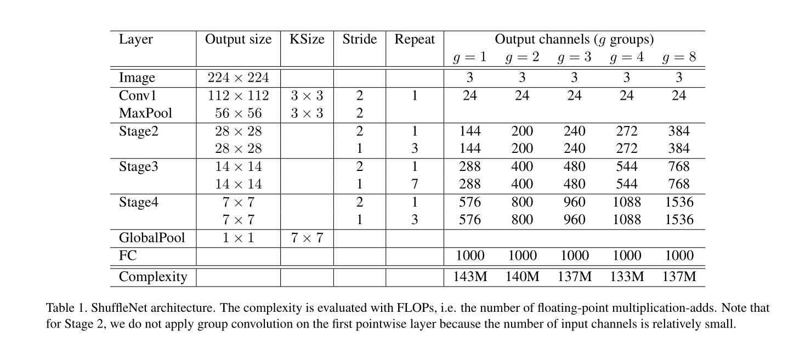

[论文地址]

## 摘要

&emsp;&emsp;我们介绍一种被设计用于计算能力有限的移动装置的卷积网络ShuffleNet，新的结构使用逐点群卷积和通道混洗方式，在保持准确率的情况下极大地减少运算量。在一个基于ARM的移动装置中，ShuffleNet在和AlexNet保持相同的准确率的情况下速度提升了13倍。

## 介绍

&emsp;&emsp;目前更大更深的网络是主流趋势，主要是为了解决主流视觉识别任务。准确率最高的网络有上百层网络和上千层通道，需要的上百亿的FLOPs(每秒浮点数运算）。这篇报告与之完全对立，在保持最高的准确率的同时把计算量控制在10~100个百万FLOPs内，专注于公共移动平台，如无人机，机器人和智能手机。之前的工作主要致力于剪枝、压缩和使用小存储量代替基础网络结构。我们致力于提出一种新的适用于计算量有限制的基础网络结构。  
&emsp;&emsp;我们注意到现在最先进的网络如Xception和ResNeXt在小网络的作用及其有限，因为密集的1X1卷积.因此我们提出逐点群卷积来降低1x1卷积的计算复杂度，群卷积会带来一些负面作用，我们使用通道混洗来解决这个问题。基于这两种方法，我们建立了一种高效结构，命名为ShuffleNet。与流行的结构相比，我们的结构可以允许更多的特征图通道在给定计算量的前提下，能够编码更多的信息，这对小网络的表现十分重要。

## 相关工作

### 高效模型的设计

&emsp;&emsp;过去几年深度神经网络在计算机视觉任务上取得了成功，其中模型设计起了很大的作用。在可嵌入设备中运行更大更深的网络的需求不断增加，这激励了高效模型设计的研究。例如，GoogleNet与简单地堆叠卷积层的网络相比，增加了网络的深度并且复杂度更低。SqueezeNet在控制准确率的情况下显著地减少了计算量和参数。ResNet使用有效的bottleneck结构来提升性能。SENet介绍了一种能够花费较小计算量来提升性能的结构单元。

### 组卷积

&emsp;&emsp;组卷积的概念是AlexNet中提出来的，当时是为了两块GPU进行运算，并且在ResNeXt中证明了其有效性。深度分离卷积在Xception中提出并且分离卷积在Inception系列中得到推广。MobileNet使用深度分离卷积并且在轻量级网络中获得了最先进的结果。我们的工作是推广群卷积和一种新形式的深度分离卷积。

### 通道混洗

&emsp;&emsp;在我们的认知中，通道混洗在高效网络模型设计中很少被提及。虽然CNNC库cuda-convnet支持随机通道卷积，这个操作相当于在组卷积后进行随机通道交换。这种“随机混洗”有不同的用途但是之后很少有人探索。最近有个two-stage卷积的工作采用了这个方法但是并没有深入研究通道混洗本身以及它在小模型设计上的作用.

### 模型加速

&emsp;&emsp;这个部分致力于加速推理同时保持预训练模型的准确率。对网络的连接和通道进行剪枝来减少网络在预训练模型的冗余连接以保模型性能。在文献中，量化和因式分解备用来减少冗余计算来加速推理。不修改参数，FFT和其它方法使用卷积方法工具来减少训练的时间消耗。把大网络的知识提炼到小网络，使训练小网络更加简单。

## 方法

### 对分组卷积的通道混洗

  
&emsp;&emsp;现在的卷积神经网络通常由相同结构组成的重复模块构成。1x1的卷积没有全部采用的原因是1x1卷积需要相当大的复杂度.在小网络中，昂贵的逐点卷积会因复杂度限制而控制通道数量，这可能显著地减少准确率.  
&emsp;&emsp;解决这个问题的直接方案是通道稀疏连接，比如包括1x1卷积的分组卷积。确保每个输入通道组上进行相应的卷积，组卷积就会显著地降低计算成本。但是这会带来新的问题：一些通道的输出仅仅来源于输入通道的一小部分。图1（a）说明了这种情况。很明显地看出，每个输出组只与它的输入组之间有联系。这个特性阻隔了通道组和弱表示的信息流动。  
&emsp;&emsp;如果我们允许分组卷积可以从不同的组中获得输入数据，(如Figure1(b)),输入通道和输出通道就会全部建立联系。对于上一层分组卷积产生的特征图，我们可以把每个组的通道分离成更小的组，然后将这些组随机排序作为下一层网络每个组的输入。这个操作可以使用通道卷积方便快捷地实现（如Figure1（c））：计算拥有$g*n$个通道数g个组的卷积层；我们需要先将数据改变形状变为$(g,n)$,然后转换和扁平化作为下一层的输入。在其中我们注意到这个操作在经过两层不同分组的卷积后依然有效。更重要的是，通道混洗过程是十分微小的，这意味着它能够嵌入到端对端的网络训练中。  
&emsp;&emsp;通道混洗操作使得使用大量分组卷积层的有效网络变得可能.在下一个部分我们将介绍一个使用分组卷积和通道混洗结构的有效的网络单元。

### ShuffleNet单元

  
&emsp;&emsp;基于通道混洗操作的优点，我们提出了专门为小网络设计的新结构ShuffleNet单元。我们的设计基于ResNet的bottleneck模块（如Figure2（a））。这是一个残差模块。在他的残差分支中，我们在bottleneck模块的特征图提取模块采用了适合运算的3x3的深度卷积。之后，我们将第一个1x1卷积替代为逐点群卷积，之后进行通道混洗，这样来组成ShuffleNet单元，如Figure2（b）。第二个逐点群卷积的作用是将通道恢复到与捷径路线相同的尺寸。简单来说，我们在第二个逐点群卷积后并没有采用通道混洗，因为采用与否对结果没有影响。在ShuffleNet单元哪个位置设置步长的问题上，我们简单地进行了两个修改（如Figure2（c））：在捷径路线上添加3x3的平均值池化层；使用通道级联（channel concatenation)代替元素相加，这样可以在很少的额外计算下扩大通道尺寸。  
&emsp;&emsp;与ResNet和RexNeXt相比较，我们的模型有更少的计算量。输入为$$c*h*w$$bottleneck通道数为m,ResNet单元要求$$hw(2cm+9m^2)$$FLOPs，ResNeXt单元要求$$hw(2cm+9m^2/g)$$FLOPs。ShuffleNet单元需要$$hw(2cm/g+9m)$$FLOPs，g是卷积的分组数。换句话说，在相同的计算量预算下，ShuffleNet可以使用更广泛的特征图。我们发现这对小网络是十分重要的，因为小网络在获取信息的过程中通道数量是不足的。  
&emsp;&emsp;另外，ShuffleNet深度卷积仅应用于bottleneck特征图。虽然深度卷积在理论上有很少的计算量，但我们发现将它移植到低功耗的移动设备上是十分困难的，与其他密集网络相比，ShuffleNet网络可能会在计算与内存存取上存在不平衡。

### 网络结构

  
&emsp;&emsp;基于ShuffleNet单元，我们建立了如Table 1的ShuffleNet网络结构。提出的网络主要是由三个阶段聚集组成的ShuffleNet单元组成的。每个阶段首先建立的模块采用的步长为2.其它的超参数设置相同，并且下一个阶段的输出通道数翻倍。我们将bottleneck的通道数设置为输出通道的1/4.我们打算提供一种尽可能简单的基本设计，尽管我们发现进一步的超参数设置可能会带来更好的结果。  
&emsp;&emsp;在ShuffleNet单元中，分组数g控制着逐点卷积的稀疏性。Table 1展示了不同组数的效果，我们采用的输出通道数尽可能使复杂度不变。效果十分明显，在相同的复杂度下大的分组导致更多的输出通道（这也意味着更多的卷积核），这意味着在输入通道有限的情况下大分组可以编码更多的信息。  
&emsp;&emsp;Table 1是网络的完全体，之后的ShuffleNet$$s*$$意味着网络的复杂度大致是原网络的$s^2$.

## 实验