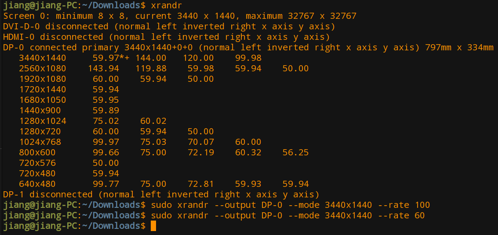

## 安装deepin与win10双系统

deepin安装需要在硬盘上分出500M的efi分区和一个根目录分区，制作安装u盘，安装完成后直接进入win10，这种情况是因为引导系统启动的是win10的efi分区文件，需要在bios界面修改引导启动的分区设置，将引导修改为deepin分区。

## deepin美化

## deepin显示器分辨率设置

使用xrandr查看显示器参数



可以看到，我使用的是DP-0接口，其中*标注的位置就是目前的分辨率和帧率，目前使用的显示参数为3440x1440分辨率，60的刷新率，我的显示器支持144刷新率，所以想使用144的刷新率。

我们可以使用xrandr来设置显示器的分辨率帧率及使用的接口：

```shell
sudo xrandr --output DP-0 --mode 3440x1440 --rate 144
```

其中 --output 后面的参数为选择输出的接口，--mode 后面的参数为显示的分辨率，--rate 后面的参数为显示的刷新率。
但是在设置完144刷新率后发现屏幕有些发灰，于是又退回到了60