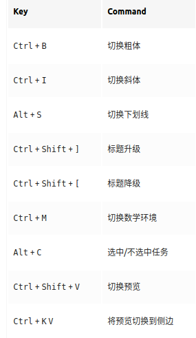

## [hexo+next博客搭建攻略](https://io-oi.me/tech/hexo-next-optimization/#%E5%8A%A0%E9%80%9F-hexo-%E5%8D%9A%E5%AE%A2)

[博客优化](http://lyxf.live/posts/2063/)

## [多端更新hexo博客](https://blog.csdn.net/Monkey_LZL/article/details/60870891)

## 更新next版本到7.7后

[7.2版本后添加背景](https://blog.csdn.net/Louis_li51/article/details/105227430)

[借鉴博客](https://tding.top/docs/getting-started/data-files.html)

&emsp;&emsp;将原来的source/css/_custom/custom.styl文件的内容复制到themes/next/source/css/_common/components/pages/pages.styl文件中

[换电脑更新博客](https://www.zhihu.com/question/21193762)

* 从[github仓库](https://github.com/JiangChenrui/JiangChenrui.github.io/tree/hexo)clone项目

* 本地安装nodejs

* 然后在项目地址下输入

    ```shell
    npm install hexo  # 安装hexo
    npm install
    npm install hexo-deployer-git
    ```

## vscode编写markdown

1. [插件推荐](https://juejin.im/post/5c45b92751882525487c5c66)
2. Markdown All in One插件快捷键
   

## hexo版本升级

* 全局升级hexo-cli，先使用`hexo version`查看当前版本，然后`npm i hexo-cli -g`更新，再次使用`hexo version`查看更新是否成功。

* 使用`npm install -g npm-check`和`npm-check`，检查系统中的插件是否有升级的，可以看到自己前面都安装了那些插件。

* 使用`npm install -g npm-upgrade`和`npm-upgrade`，升级系统中的插件

* 使用npm update -g和npm update --save

## npm更换国内源

在使用npm安装过程中发现下载很慢，网上查找问题后，可以使用更换国内源的方法解决。

```shell
npm config set registry http://registry.npm.taobao.org
```