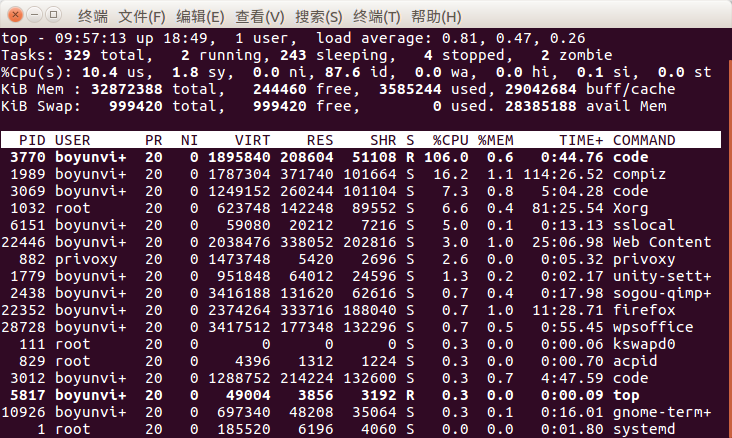
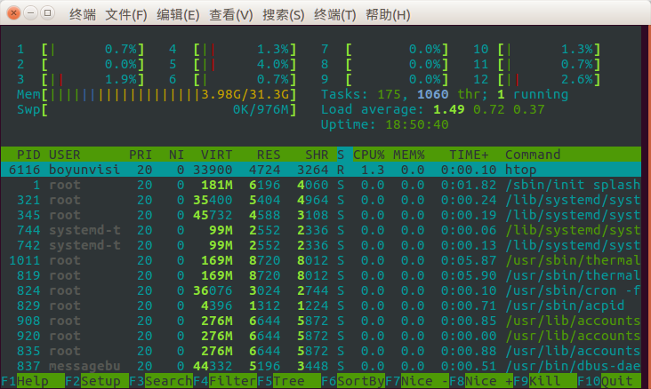
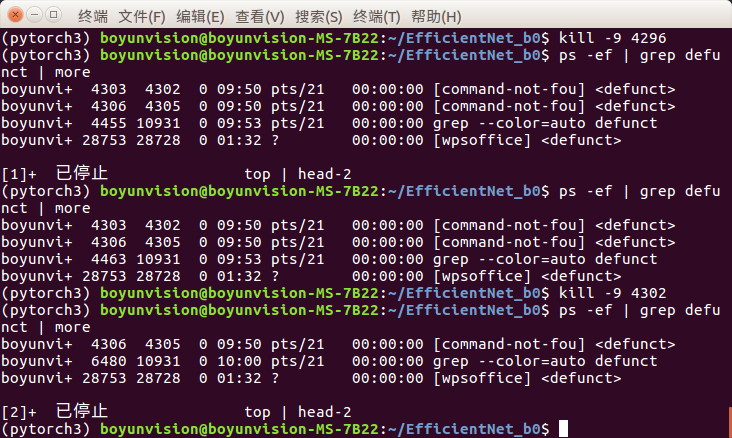

## linux资源查看工具top

在自动输入top后显示的信息如下


同样可以使用htop来查看


## linux杀死僵尸进程

在终端输入

```shell
ps -ef | grep defunct | more
```

查看僵尸进程的详细信息，如图：

其中第二列为进程PID，第三列为父进程PID，对所有进程的父进程执行kill -9 进程号的操作来杀死僵尸进程

## 将图片地址提取到txt

```shell
ls -R /data/*.jpg > file.txt
cat *.txt > all.txt  // 将所有txt拼接
```
