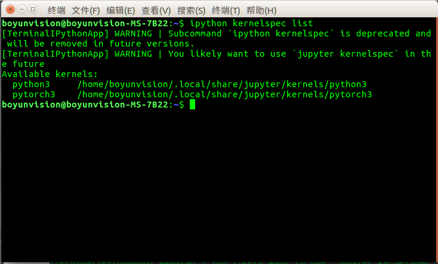

&emsp;&emsp;最近使用jupyter发现在虚拟环境下安装了包，但是在该环境下启动的jupyter却不能正确导入包，问题应该出在jupyter调用的python包和环境下的包不一样导致的，以下是解决方法，[参考博客](https://blog.csdn.net/qq_34650787/article/details/83304080)

* **首先激活要用的虚拟环境，查看python路径**

    ```python
    import sys
    sys.executable

    '/home/boyunvision/pytorch3.6/bin/python'
    ```

* **然后在jupyter下进行同样操作**

    ```python
    import sys
    sys.executable

    '/usr/bin/python'
    ```

    可以看到两者的路径不一样  

* **然后找到jupyter定义python路径的文件**

    ```shell
    ipython kernelspec list
    ```



* **在该目录下打开kernel.json文件，将python修改为虚拟环境路径**
  
    ```bash
    {
    "argv": [
    "/usr/bin/python", % 修改为"/home/boyunvision/pytorch/bin/python3"
    "-m",
    "ipykernel_launcher",
    "-f",
    "{connection_file}"
    ],
    "display_name": "Python 3",
    "language": "python"
    }
    ```
