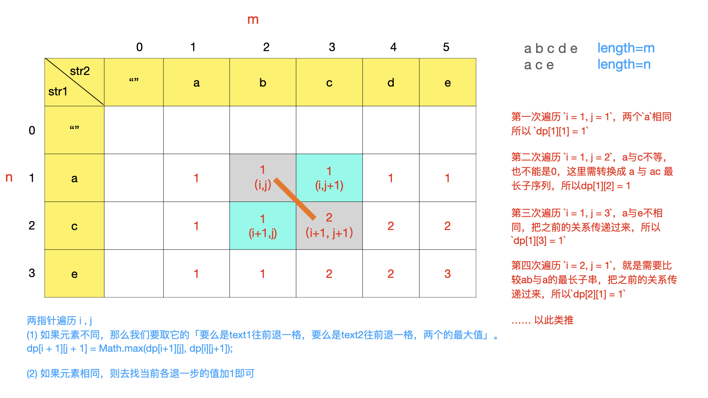

## 数据结构

数据结构是计算机内部数据的组织形式和存储方法，常用的数据结构有线性结构、数结构、图结构。


### 线性结构

线性结构主要包括：顺序表、链表、栈、队列等基本形式。其中顺序表和链表是从存储形式上（或物理结构上）区分的，而栈和队列是从逻辑功能上区分的。也就是说，顺序表和链表是线性数据结构的基础，队列和栈是基于顺序表和链表的，它们由顺序表或链表构成。

#### 栈的实现

```c++
#ifndef STACK_HPP
#define STACK_HPP
#include <iostream>
using namespace std;

template <class T>
class Stack {
public:
    Stack();
    Stack(int capacity);
    ~Stack();
    bool IsEmpty();                 // 判断是否为空
    bool IsFull();                  // 判断栈是否已满
    void ClearStack();              // 清空栈
    int Length();                   // 获取栈的长度
    bool Push(const T &element);    // 获取元素
    bool Pop(T &ele);               // 弹出栈顶元素
    void StackTraverse();           // 遍历栈

private:
    T *m_stack;     // 容器
    int m_top;      // 栈顶
    int m_capacity; // 容器容量
};

template <typename T>
Stack<T>::Stack() {
    cout << "构造函数" << endl;
}

template <typename T>
Stack<T>::Stack(int capacity) {
    this->m_capacity = capacity;
    this->m_top = 0;
    this->m_stack = new T[this->m_capacity];
}

template <typename T>
Stack<T>::~Stack() {
    if (this->m_stack != NULL) {
        delete[] this->m_stack;
        this->m_stack = NULL;
    }
}

template <typename T>
bool Stack<T>::IsEmpty() {
    return this->m_top == 0 ? true : false;
}

template <typename T>
bool Stack<T>::IsFull() {
    return this->m_top == this->m_capacity ? true : false;
}

template <typename T>
void Stack<T>::ClearStack() {
    this->m_top = 0;
}

template <typename T>
int Stack<T>::Length() {
    return this->m_top;
}

template <typename T>
bool Stack<T>::Push(const T &element) {
    if (IsFull()) {
        return false;
    } else {
        this->m_stack[this->m_top++] = element;
        return true;
    }
}

template <typename T>
bool Stack<T>::Pop(T &ele) {
    if (!IsEmpty()) {
        this->m_top--;
        ele = this->m_stack[this->m_top];
        return true;
    } else {
        return false;
    }
}

template <typename T>
void Stack<T>::StackTraverse() {
    if (!IsEmpty()) {
        for (int i = m_top - 1; i >= 0; --i) {
            cout << this->m_stack[i] << ' ';
        }
        cout << endl;
    } else {
        cout << "栈为空" << endl;
    }
}
#endif
```

#### 队列的实现

```c++
#ifndef MYQUEUE_HPP
#define MYQUEUE_HPP
#include <iostream>
using namespace std;

template <typename T>
struct QueueNode {
    T data;
    QueueNode *next;
    QueueNode () {
        this->next = NULL;
    }
};

template <class T>
class MyQueue {
public:
    MyQueue() {
        this->count = 0;
        this->head = new QueueNode <T>();
        this->tail = new QueueNode <T>();
        this->tail = this->head;
    }
    ~MyQueue() {
        if (this->head != NULL) {
            cout << "释放head" << endl;
            delete[] this->head;
            this->head = NULL;
        }
        if (this->tail != NULL) {
            cout << "释放tail" << endl;
            delete[] this->tail;
            this->tail = NULL;
        }
    }
    int size() {
        return this->count;
    }
    bool IsEmpty() {
        if (size() == 0) {
            return true;
        } else {
            return false;
        }
    }
    void InQueue(T val) {
        QueueNode <T> *temp = new QueueNode<T>();
        temp->data = val;
        this->tail->next = temp;
        this->tail = temp;
        this->count++;
    }
    QueueNode<T>* OutQueue() {
        if (this->count == 0) {
            cout << "队列为空" << endl;
            return NULL;
        }
        QueueNode <T> *temp = this->head->next;
        if (temp) {
            this->head->next = temp->next;
            temp->next = NULL;
            this->count--;
        }
        return temp;
    }
    void QueueTraverse() {
        if (this->count == 0) {
            cout << "队列为空" << endl;
            return;
        }
        QueueNode <T> *temp = head->next;
        while (temp) {
            cout << temp->data << ' ';
            temp = temp->next;
        }
        cout << endl;
    }
    void Remove() {
        this->head->next = NULL;
        this->tail = this->head;
        this->count = 0;
    }

private:
    int count;
    QueueNode <T> *head;
    QueueNode <T> *tail;
};

#endif
```

#### 链表反转

使用两个节点pre和next，先用next保存当前节点的next指针，然后将当前节点next指针指向上一个节点pre，接下来将当前节点赋值给pre，next赋值给当前节点进行下一循环，直到当前节点为NULL。

```c++
struct ListNode {
	int val;
	struct ListNode *next;
	ListNode(int x) : val(x), next(NULL) {}
};

/**
 * 链表反转
 */
ListNode* ReverseList(ListNode *pHead) {
    if(pHead == NULL)
        return NULL;
    ListNode *pre = NULL;
    ListNode *next = NULL;
    while (pHead != NULL) {
        next = pHead->next;
        pHead->next = pre;
        pre = pHead;
        pHead = next;
    }
    return pre;
}
```

#### 寻找第k大

```c++
int Partition(vector<int> &arr, int start, int end) {
    // 降序排列
    if (start == end)
        return start;
    int left = start, right = end, key = arr[start];
    while (left < right) {
        while (left < right && arr[right] <= key)
            right--;
        arr[left] = arr[right];
        while (left < right && arr[left] >= key)
            left++;
        arr[right] = arr[left];
    }
    arr[left] = key;
    return left;
}

/**
 * 寻找第k大
 */
int findKth(vector<int> a, int n, int K) {
    int low = 0;
    int high = n - 1;
    int mid;
    while (low <= high) {
        mid = Partition(a, low, high);
        if (K < mid + 1) {
            // 在左半段
            high = mid - 1;
        } else  if (K > mid + 1) {
            // 在右半段
            low = mid + 1;
        } else {
            return a[mid];
        }
    }
    return -1;
}
```

#### 括号序列

给出一个仅包含字符'(',')','{','}','['和']',的字符串，判断给出的字符串是否是合法的括号序列，括号必须以正确的顺序关闭，"()"和"()[]{}"都是合法的括号序列，但"(]"和"([)]"不合法。
```c++
bool isValid(string s) {
    // 如果字符串长度不是偶数，则不合法
    if (s.size() & 1 != 0)
        return false;
    stack<char> temp;
    for (int i = 0; i < s.size(); ++i) {
        if (s[i] == '(' || s[i] == '{' || s[i] == '[')
            temp.push(s[i]);
        else {
            if (temp.empty())
                return false;
            switch (s[i]) {
                case '}':
                    if (temp.top() == '{')
                        temp.pop();
                    break;
                case ']':
                    if (temp.top() == '[')
                        temp.pop();
                    break;
                case ')':
                    if (temp.top() == '(')
                        temp.pop();
                    break;
                default:
                    return false;
            }
        }
    }
    if (!temp.empty())
        return false;
    return true;
}
```

#### 链表中的节点每k有一组翻转

**题目描述**

将给出的链表中的节点每$k$个一组翻转，返回翻转后的链表  
如果链表中的节点数不是$k$的倍数，将最后剩下的节点保持原样  
你不能更改节点中的值，只能更改节点本身。  
要求空间复杂度$O(1)$。
例如：
给定的链表是$1→2→3→4→5$
* 对于 $k = 2$, 你应该返回 $2→1→4→3→5$
* 对于 $k = 3$, 你应该返回 $3→2→1→4→5$

```c++
/**
 * 链表中的节点每k有一组翻转
 * @param head
 * @param k
 * @return
 */
ListNode* reverseKGroup(ListNode* head, int k) {
    if (head == NULL)
        return NULL;
    ListNode *temp = head;
    int len = 0;
    while (temp != NULL) {
        temp = temp->next;
        ++len;
    }
    temp = head;
    if (len < k)
        return head;
    ListNode *pre = NULL;
    ListNode *next = NULL;
    for (int i = 0; i < k; ++i) {
        next = head->next;
        head->next = pre;
        pre = head;
        head = next;
    }
    temp->next = reverseKGroup(head, k);
    return pre;    
}
```

#### 判断链表中是否有环

[链表和快慢指针](https://zhuanlan.zhihu.com/p/38521018)

```c++
/**
 * 判断给定的链表是否有环
 * @param head
 * @return
 */
bool hasCycle(ListNode *head) {
    ListNode *low, *quick;
    low = quick = head;
    while (quick->next->next != NULL && quick->next != NULL) {
        low = low->next;
        quick = quick->next->next;
        if (low == quick)
            return true;
    }
    return false;
}
```

#### 链表中环的入口

```c++
ListNode *detectCycle(ListNode *head) {
    if (head == NULL)
        return 0;
    ListNode *slow = head;
    ListNode *fast = head;
    while (fast != NULL && fast->next != NULL) {
        slow = slow->next;
        fast = fast->next->next;
        if (slow == fast)
            break;
    }
    if (fast == NULL || fast->next == NULL)
        return NULL;
    fast = head;
    while (slow != fast) {
        slow = slow->next;
        fast = fast->next;
    }
    return slow;
}
```

#### 合并有序链表

```c++
ListNode* mergeTwoLists(ListNode* l1, ListNode* l2) {
    ListNode *head = new ListNode(-1);
    ListNode *temp = head;
    while (l1 != NULL || l2 != NULL) {
        if (l1 == NULL) {
            temp->next = l2;
            break;
        }
        if (l2 == NULL) {
            temp->next = l1;
            break;
        }
        if (l1->val < l2->val) {
            temp->next = l1;
            l1 = l1->next;
        } else {
            temp->next = l2;
            l2 = l2->next;
        }
        temp = temp->next;
    }
    return head;
}
```

#### 删除链表的倒数第N个节点

```c++
/**
 * 删除链表倒数第N个节点
 * @param head ListNode类 
 * @param n int整型 
 * @return ListNode类
 */
ListNode* removeNthFromEnd(ListNode* head, int n) {
    if (head == NULL)
        return NULL;
    ListNode *dummy = new ListNode(0);
    dummy->next = head;
    head = dummy;
    ListNode *slow = head;
    ListNode *fast = head;
    for (int i = 0; i < n; ++i) {
        fast = fast->next;
    }
    while (fast->next != NULL) {
        slow = slow->next;
        fast = fast->next;
    }
    ListNode *temp = slow->next;
    slow->next = slow->next->next;
    delete temp;
    return dummy->next;
}
```

#### 两个链表相加生成相加链表
```c++
/**
 * 两个链表相加生成相加链表
 */
ListNode* addInList(ListNode* head1, ListNode* head2) {
    stack<ListNode *> s1;
    stack<ListNode *> s2;
    while (head1) {
        s1.push(head1);
        head1 = head1->next;
    }
    while (head2) {
        s2.push(head2);
        head2 = head2->next;
    }
    int flag = 0;
    while (!s1.empty() || !s2.empty()) {
        int sum = flag;
        if (!s1.empty()) {
            sum += s1.top()->val;
            head1 = s1.top();
            s1.pop();
        }
        if (!s2.empty()) {
            sum += s2.top()->val;
            if (s2.size() > s1.size())
                head1 = s2.top();
            s2.pop();
        }
        if (sum < 10) {
            head1->val = sum;
            flag = 0;
        } else {
            head1->val = sum % 10;
            flag = sum / 10;
        }
    }
    if (flag > 0) {
        ListNode *head = new ListNode(flag);
        head->next = head1;
        return head;
    }
    return head1;
}
```

#### 将字符串转换为整数

```c++
int StrToInt(string str) {
    if (str.empty())
        return 0;
    int res = 0;
    int mark = (str[0] == '-') ? -1 : 1;
    int i = (str[0] == '+' || str[0] == '-') ? 1 : 0;
    for (; i < str.size(); ++i) {
        if (str[i] < '0' || str[i] > '9')
            return 0;
        res = res*10 + str[i] - '0';
    }
    return res*mark;
}
```

#### 数组中重复的数字


在一个长度为n的数组里的所有数字都在0到n-1的范围内。 数组中某些数字是重复的，但不知道有几个数字是重复的。也不知道每个数字重复几次。请找出数组中任意一个重复的数字。 例如，如果输入长度为7的数组{2,3,1,0,2,5,3}，那么对应的输出是第一个重复的数字2。

```c++
bool duplicate(int numbers[], int length, int* duplication) {
    if (length == 0 || length == 1)
        return false;
    int *tempArr = new int[length]();
    for (int i = 0; i < length; ++i) {
        if (tempArr[numbers[i]] == 0)
            tempArr[numbers[i]] = 1;
        else {
            *duplication = numbers[i];
            return true;
        }
    }
    return false;
}
```

#### 构建乘积数组

给定一个数组A[0,1,...,n-1],请构建一个数组B[0,1,...,n-1],其中B中的元素B[i]=A[0]*A[1]*...*A[i-1]*A[i+1]*...*A[n-1]。不能使用除法。（注意：规定B[0] = A[1] * A[2] * ... * A[n-1]，B[n-1] = A[0] * A[1] * ... * A[n-2];）
对于A长度为1的情况，B无意义，故而无法构建，因此该情况不会存在。

```c++
vector<int> multiply(const vector<int>& A) {
    vector<int> B(A.size(), 1);
    B[0] = 1;
    for (int i = 1; i < A.size(); ++i) {
        B[i] = B[i-1] * A[i-1];
    }
    int temp = 1;
    for (int j = A.size() - 1; j >= 0; j--) {
        B[j] *= temp;
        temp *= A[j];
    }
    return B;
}
```

#### 表示数值的字符串

**题目描述**

请实现一个函数用来判断字符串是否表示数值（包括整数和小数）。例如，字符串"+100","5e2","-123","3.1416"和"-1E-16"都表示数值。 但是"12e","1a3.14","1.2.3","+-5"和"12e+4.3"都不是。

```c++
bool isNumeric(char* str) {
    // 标记符号、小数点、e是否出现过
    bool sign = false, decimal = false, hasE = false;
    for (int i = 0; i < strlen(str); i++) {
        if (str[i] == 'e' || str[i] == 'E') {
            if (i == strlen(str)-1) return false; // e后面一定要接数字
            if (hasE) return false;  // 不能同时存在两个e
            hasE = true;
        } else if (str[i] == '+' || str[i] == '-') {
            // 第二次出现+-符号，则必须紧接在e之后
            if (sign && str[i-1] != 'e' && str[i-1] != 'E') return false;
            // 第一次出现+-符号，且不是在字符串开头，则也必须紧接在e之后
            if (!sign && i > 0 && str[i-1] != 'e' && str[i-1] != 'E') return false;
            sign = true;
        } else if (str[i] == '.') {
            // e后面不能接小数点，小数点不能出现两次
            if (hasE || decimal) return false;
            decimal = true;
        } else if (str[i] < '0' || str[i] > '9') // 不合法字符
            return false;
    }
    return true;
}
```

#### 字符流中第一个不重复的字符

```c++
class Solution
{
public:
    Solution() {
        cnt = new int[128]();
    }
    ~Solution() {
        if (cnt != NULL)
            delete[] cnt;
        cnt = NULL;
    }
    void Insert(char ch) {
        ++cnt[ch - '\0'];
        if (cnt[ch - '\0'] == 1)
            data.push(ch);
    }
    char FirstAppearingOnce() {
        while (!data.empty() && cnt[data.front() - '\0'] > 1)
            data.pop();
        if (data.empty())
            return '#';
        return data.front();
    }

private:
    queue<char> data;
    int *cnt;
};
```

#### 删除链表中重复的结点

```c++
// 删除链表中重复的结点
ListNode* deleteDuplication(ListNode* pHead) {
    ListNode *slow, *fast;
    ListNode *Head = new ListNode(0);
    Head->next = pHead;
    slow = Head;
    fast = Head->next;
    while (fast != NULL) {
        if (fast->next != NULL && fast->val == fast->next->val) {
            while (fast->next != NULL && fast->val == fast->next->val)
                fast = fast->next;
            slow->next = fast->next;
            fast = fast->next;
        } else {
            slow = slow->next;
            fast = fast->next;
        }
    } 
    return Head->next;
}
```

#### 两两交换链表中的节点

```c++
ListNode* swapPairs(ListNode* head) {
    ListNode* res = new ListNode(0);
    res->next = head;
    ListNode* first = res;
    while (first->next != NULL && first->next->next != NULL) {
        ListNode* second = first->next;
        ListNode* third = first->next->next;

        first->next = third;
        second->next = third->next;
        third->next = second;

        first = second;
    }
    return res->next;
}
```

#### 字符串的排列

```c++
// 后剪枝
void dfs(string s, int start, set<string>& res) {
    if (s.size() == start) {
        res.insert(s);
        return;
    }
    for (int i = start; i < s.size(); ++i) {
        swap(s[i], s[start]);
        dfs(s, start+1, res);
        swap(s[i], s[start]);
    }
}
// 过程中剪枝
void dfs(string s, int start, vector<string>& res) {
    if (s.size() == start) {
        res.push_back(s);
        return;
    }
    set<char> st;
    for (int i = start; i < s.size(); ++i) {
        if (st.count(s[i])) continue;
        st.insert(s[i]);
        swap(s[i], s[start]);
        dfs(s, start+1, res);
        swap(s[i], s[start]);
    }
}
vector<string> permutation(string s) {
    vector<string> res;
    dfs(s, 0, res);
    return res;
}
```

### 树结构

数据之间存在“一对多”的关系构成了树结构。

#### 二叉树中序遍历

递归方法
```c++
void inorder(TreeNode *node, vector<int> &res) {
    if (node == NULL)
        return;
    inorder(node->left, res);
    res.push_back(node->val);
    inorder(node->right, res);
}

// 二叉树中序遍历
vector<int> inorderTraversal(TreeNode* root) {
    vector<int> res;
    inorder(root, res);
    return res;
}
```

非递归方法
```c++
vector<int> inorderTraversal(TreeNode* root) {
    vector<int> res;
    stack<TreeNode*> node;
    while (root != NULL || !node.empty()) {
        for (; root != NULL; root = root->left) {
            node.push(root);
        }
        res.push_back(node.top()->val);
        root = node.top()->right;
        node.pop();
    }
    return res;
}
```

#### 验证二叉搜索树

```c++
// 验证二叉搜索树
bool isValidBST(TreeNode* root) {
    stack<TreeNode*> stack;
    long long inorder = INT32_MIN - 1;
    while (root != NULL || !stack.empty()) {
        for (; root != NULL; root = root->left)
            stack.push(root);
        if (stack.top()->val <= inorder)
            return false;
        inorder = stack.top()->val;
        root = stack.top()->right;
        stack.pop();
    }
    return true;
}
```
#### 二叉树的第k大节点
```c++
int kthLargest(TreeNode* root, int k) {
    if (root == NULL)
        return 0;
    stack<TreeNode*> node;
    int num = 1;
    while (root != NULL || !node.empty()) {
        for (; root != NULL; root = root->right) {
            node.push(root);
        }
        root = node.top()->left;
        if (num == k)
            return node.top()->val;
        node.pop();
        num++;
    }
    return 0;
}
```

#### 二叉树前序遍历

递归方法
```c++
void preorder(TreeNode* node, vector<int> &res) {
    if (!node)
        return;
    res.push_back(node->val);
    preorder(node->left, res);
    preorder(node->right, res);
}
// 二叉树前序遍历
vector<int> preorderTraversal(TreeNode* root) {
    vector<int> res;
    preorder(root, res);
    return res;
}
```

非递归方法
```c++
vector<int> preorderTraversal(TreeNode* root) {
    vector<int> res;
    stack<TreeNode*> node;
    while (root!=NULL || !node.empty()) {
        for (; root!=NULL; root = root->left) {
            res.push_back(root->val);
            node.push(root);
        }
        root = node.top()->right;
        node.pop();
    }
    return res;
}
```

#### 二叉树后序遍历

递归方法
```c++
void postorder(TreeNode* node, vector<int> &res) {
    if (!node)
        return;
    postorder(node->left, res);
    postorder(node->right, res);
    res.push_back(node->val);
}

// 二叉树后序遍历
vector<int> postorderTraversal(TreeNode* root) {
    vector<int> res;
    postorder(root, res);
    return res;
}
```

非递归方法
```c++
vector<int> postorderTraversal(TreeNode* root) {
    vector<int> res;
    stack<TreeNode*> node;
    TreeNode *cur = root;
    while (cur != NULL || !node.empty()) {
        while (cur) {
            res.push_back(cur->val);
            node.push(cur);
            cur = cur->right;
        }
        cur = node.top()->left;
        node.pop();
    }
    reverse(res.begin(), res.end());
    return res;
}
```

#### 二叉树层序遍历

递归方法
```c++
void levelOrder(TreeNode* root, int level, vector<vector<int>> &v) {
    if (root == NULL)
        return;
    if (v.size() < level + 1)
        v.resize(level + 1);
    v[level].push_back(root->val);
    levelOrder(root->left, level+1, v);
    levelOrder(root->right, level+1, v);
}
// 二叉树的层序遍历
vector<vector <int>> levelOrder(TreeNode* root) {
    vector<vector <int>> res;
    levelOrder(root, 0, res);
    return res;
}
```

非递归
```c++
vector<vector <int>> levelOrder(TreeNode* root) {
    vector<vector <int>> res;
    if (root == NULL)
        return res;
    queue<TreeNode*> q;
    q.push(root);
    int level = 0;
    while (!q.empty()) {
        int size = q.size();
        res.push_back(vector<int>());
        for (int i = 0; i < size; ++i) {
            TreeNode* temp = q.front();
            q.pop();
            res[level].push_back(temp->val);
            if (temp->left != NULL)
                q.push(temp->left);
            if (temp->right != NULL)
                q.push(temp->right);
        }
        ++level;
    }
    return res;
}
```

#### 二叉树的锯齿形层次遍历

递归
```c++
void zigzagLevel(TreeNode* node, int level, vector<vector <int>> &res) {
    if (node == NULL)
        return;
    if (res.size() < level + 1)
        res.push_back(vector<int>());
    if (level % 2 == 0)
        res[level].push_back(node->val);
    else
        res[level].insert(res[level].begin(), node->val);
    zigzagLevel(node->left, level+1, res);
    zigzagLevel(node->right, level+1, res);    
}
// 二叉树的锯齿形层次遍历
vector<vector <int>> zigzagLevelOrder(TreeNode* root) {
    vector<vector <int>> res;
    zigzagLevel(root, 0, res);
    return res;
}
```
非递归
```c++
vector<vector <int>> zigzagLevelOrder(TreeNode* root) {
    vector<vector <int>> res;
    if (root == NULL)
        return res;
    queue<TreeNode*> q;
    int level = 0;
    q.push(root);
    while (!q.empty()) {
        int size = q.size();
        res.push_back(vector<int>());
        for (int i = 0; i < size; ++i) {
            TreeNode* temp = q.front();
            q.pop();
            if (level % 2 == 0)
                res[level].push_back(temp->val);
            else
                res[level].insert(res[level].begin(), temp->val);
            if (temp->left != NULL)
                q.push(temp->left);
            if (temp->right != NULL)
                q.push(temp->right);
        }
        ++level;
    }
    return res;
}
```

#### 二叉树的层次遍历2

```c++
vector<vector<int>> levelOrderBottom(TreeNode* root) {
    vector<vector <int>> res;
    if (root == NULL)
        return res;
    queue<TreeNode*> q;
    q.push(root);
    while (!q.empty()) {
        int size = q.size();
        vector<int> temp;
        for (int i = 0; i < size; ++i) {
            TreeNode* node = q.front();
            temp.push_back(node->val);
            q.pop();
            if (node->left != NULL)
                q.push(node->left);
            if (node->right != NULL)
                q.push(node->right);
        }
        res.push_back(temp);
    }
    reverse(res.begin(), res.end());
    return res;
}
```

#### 二叉树的右视图

```c++
// 二叉树的右视图
vector<int> rightSideView(TreeNode* root) {
    queue<TreeNode*> node;
    vector<int> res;
    if (root == NULL)
        return res;
    node.push(root);
    while (!node.empty()) {
        int size = node.size();
        TreeNode* temp;
        for (int i = 0; i < size; ++i) {
            temp = node.front();
            node.pop();
            if (temp->left != NULL)
                node.push(temp->left);
            if (temp->right != NULL)
                node.push(temp->right);
        }
        res.push_back(temp->val);
    }
    return res;
}
```

#### 二叉树的最大深度

递归
```c++
int maxDepth(TreeNode* root) {
    if (root == NULL)
        return 0;
    return 1+max(maxDepth(root->left), maxDepth(root->right));
}
```

非递归
```c++
int maxDepth(TreeNode* root) {
    queue<TreeNode*> q;
    if (root == NULL)
        return 0;
    q.push(root);
    int level = 0;
    while (!q.empty()) {
        int size = q.size();
        for (int i = 0; i < size; ++i) {
            if (q.front()->left != NULL)
                q.push(q.front()->left);
            if (q.front()->right != NULL)
                q.push(q.front()->right);
            q.pop();
        }
        ++level;
    }
    return level;
}
```

#### 二叉树的最近公共组先

```c++
TreeNode* lowestCommonAncestor(TreeNode* root, TreeNode* p, TreeNode* q) {
    if (root == NULL || root == p || root == q)
        return root;
    TreeNode* left = lowestCommonAncestor(root->left, p, q);
    TreeNode* right = lowestCommonAncestor(root->right, p, q);

    if (left == NULL)
        return right;
    if (right == NULL)
        return left;
    if (left && right)
        return root;
    return NULL;
}
```

#### 平衡二叉树

暴力破解
```c++
int GetTreeDepth(TreeNode* root) {
    if (root == NULL)
        return 0;
    return 1 + max(GetTreeDepth(root->left), GetTreeDepth(root->right));
}

// 平衡二叉树
bool isBalanced(TreeNode* root) {
    if (root == NULL)
        return true;
    if (abs(GetTreeDepth(root->left) - GetTreeDepth(root->right)) > 1)
        return false;
    return isBalanced(root->left) && isBalanced(root->right);
}
```

```c++
int recur(TreeNode* node) {
    if (node == NULL)
        return 0;
    int left = recur(node->left);
    if (left == -1)
        return -1;
    int right = recur(node->right);
    if (right == -1)
        return -1;
    return abs(left-right) < 2 ? max(left, right) + 1 : -1;
}
bool isBalanced(TreeNode* root) {
    if (root == NULL)
        return true;
    return recur(root) != -1;
}
```

#### 二叉搜索树的插入操作

递归
```c++
TreeNode* insertIntoBST(TreeNode* root, int val) {
    if (root == NULL)
        return new TreeNode(val);
    if (root->val > val)
        root->left = insertIntoBST(root->left, val);
    else
        root->right = insertIntoBST(root->right, val);
    return root;
}
```

迭代
```c++
TreeNode* insertIntoBST(TreeNode* root, int val) {
    TreeNode* node = root;
    if (root == NULL) {
        root = new TreeNode(val);
        return root;
    }
    while (node != NULL) {
        if (node->val > val) {
            if (node->left != NULL)
                node = node->left;
            else {
                node->left = new TreeNode(val);
                break;
            }
        } else if (node->val < val){
            if (node->right != NULL)
                node = node->right;
            else {
                node->right = new TreeNode(val);
                break;
            }
        }
        
    }
    return root;
}
```

#### [恢复二叉搜索树](https://leetcode-cn.com/problems/recover-binary-search-tree/submissions/)

```c++
void recoverTree(TreeNode* root) {
    if (root == NULL)
        return;
    stack<TreeNode*> node;
    vector<TreeNode*> num;
    vector<int> swap;
    TreeNode* head = root;
    while (head != NULL || !node.empty()) {
        for (; head != NULL; head = head->left)
            node.push(head);
        num.push_back(node.top());
        head = node.top()->right;
        node.pop();
    }
    for (int i = 0; i < num.size() - 1; ++i) {
        if (num[i]->val > num[i+1]->val)
            swap.push_back(i);
    }
    if (swap.size() == 1) {
        int temp = num[swap[0]]->val;
        num[swap[0]]->val = num[swap[0]+1]->val;
        num[swap[0]+1]->val = temp;     
    } else {
        int temp = num[swap[0]]->val;
        num[swap[0]]->val = num[swap[1]+1]->val;
        num[swap[1]+1]->val = temp;
    }
}
```

#### 不同的二叉搜索树2

```c++
vector<TreeNode*> generateTrees(int start, int n) {
    vector<TreeNode*> ans;
    if (start > n) return {NULL};
    for (int i = start; i <= n; ++i) {
        for (auto left : generateTrees(start, i - 1)) {
            for (auto right : generateTrees(i+1, n)) {
                TreeNode* root = new TreeNode(i, left, right);
                ans.push_back(root);
            }
        }
    }
    return ans;
}
vector<TreeNode*> generateTrees(int n) {
    if (n == 0) return {};
    return generateTrees(1, n);
}
```

#### 二叉树的最大路径和

```c++
/**
 * 二叉树的最大路径和
 * @param root
 * @param sum
 * @return ret 当前结点最大路径和
 */
int maxPathSum(TreeNode* root, int &sum) {
    if (root == NULL)
        return 0;
    // 左结点最大路径和
    int left = max(maxPathSum(root->left, sum), 0);
    // 右节点最大路径和
    int right = max(maxPathSum(root->right, sum), 0);
    // 左节点+右节点+当前节点的路径和
    int lmr = root->val + left + right;
    sum = max(sum, lmr);
    // 返回当前节点可以连接父节点的最大值
    return root->val + max(left, right);
}
int maxPathSum(TreeNode* root) {
    int val = INT8_MIN;
    maxPathSum(root, val);
    return val;
}
```

#### 数的子结构

```c++
bool recur(TreeNode* A, TreeNode* B) {
    if (B == NULL)
        return true;
    if (A == NULL || A->val != B->val)
        return false;
    return recur(A->left, B->left) && recur(A->right, B->right);
}
bool isSubStructure(TreeNode* A, TreeNode* B) {
    if (A == NULL || B == NULL)
        return false;
    bool root = recur(A, B);
    bool left = isSubStructure(A->left, B);
    bool right = isSubStructure(A->right, B);
    return root || left || right;
}
```

#### 对称二叉树

```c++
bool isSymmetric(TreeNode* left, TreeNode* right) {
    if (left == NULL && right == NULL)
        return true;
    if (left == NULL || right == NULL)
        return false;
    if (left->val != right->val)
        return false;
    return isSymmetric(left->left, right->right) && isSymmetric(left->right, right->left);
}
bool isSymmetric(TreeNode* root) {
    if (root == NULL)
        return true;
    return isSymmetric(root->left, root->right);
}
```

#### 二叉树中和为某一值的路径

```c++
void pathSum(TreeNode* root, vector<vector<int>>& res, vector<int>& temp, int sum) {
    if (root == NULL) {
        return;
    }
    temp.push_back(root->val);
    if (root->val == sum && root->left == NULL && root->right == NULL)
        res.push_back(temp);
    pathSum(root->left, res, temp, sum-root->val);
    pathSum(root->right, res, temp, sum-root->val);
    temp.pop_back();
}
vector<vector<int>> pathSum(TreeNode* root, int sum) {
    vector<vector<int>> res;
    if (root == NULL)
        return res;
    vector<int> tmp;
    pathSum(root, res, tmp, sum);
    return res;
}
```

#### 二叉树与双向链表

```c++
class solution {
public:
    Node* treeToDoublyList(Node* root) {
        if (root == NULL) return NULL;
        dfs(root);
        head->left = pre;
        pre->right = head;
        return head;
    }
private:
    Node *pre, *head;
    void dfs(Node* cur) {
        if (cur == NULL) return;
        dfs(cur->left);
        if (pre != NULL) pre->right = cur;
        else head = cur;
        cur->left = pre;
        pre = cur;
        dfs(cur->right);
    }
}
```

### 图结构

图结构中数据元素之间存在着“多对多”的关系。

#### 广度优先

## 算法

### 查找和排序

#### 顺序查找

```c++
int search(Student *stu, int n, int  key) {
    for (int i = 0; i < n; ++i) {
        if (stu[i].id == key)
            return i;
    }
    return -1;
}
```

#### 折半查找

```c++
/**
 * 折半查找
 * @param key 关键字顺序表
 * @param n 记录个数
 * @param k 要查找的关键字
 * @return
 */
int bin_search(int *key, int n, int k) {
    int low = 0, high = n - 1, mid;
    while (low <= high) {
        mid = (low + high) / 2;
        if (key[mid] == k)
            return mid;
        if (k > key[mid])
            low = mid + 1;
        else 
            high = mid - 1;
    }
    return -1;
}
```
请实现有重复数字的有序数组的二分查找。  
输出在数组中第一个大于等于查找值的位置，如果数组中不存在这样的数，则输出数组长度加一。

```c++
int bin_search(int n, int v, vector<int>& a) {
    int left = 0;
    int right = n - 1;
    int mid;
    while (left <= right) {
        mid = (left + right) / 2;
        if (a[mid] >= v) {
            if (mid == 0 || a[mid-1] < v)
                return mid + 1;
            else
                right = mid - 1;
        }
        else
            left = mid + 1;
    }
    return n + 1;
}
```
#### 直接插入排序

```c++
/**
 * 直接插入排序
 * @param arr 数组
 * @param n 数组元素个数
 */
void insertSort(int arr[], int n) {
    for (int i = 1; i < n; ++i) {
        int temp = arr[i];
        int j = i - 1;
        // for (j; j >= 0; --j) {
        //     if (temp < arr[j]) {
        //         arr[j + 1] = arr[j];
        //     } else {
        //         break;
        //     }
        // }
        // arr[j + 1] = temp;

        while (j >= 0 && temp < arr[j]) {
            arr[j+1] = arr[j];
            j--;
        }
        arr[j+1] = temp;
    }
}
```

#### 选择排序

```c++
/**
 * 选择排序
 * @param arr 数组
 * @param n 数组元素个数
 */
void selectSort(int arr[], int n) {
    for (int i = 0; i < n; ++i) {
        int min = i, temp;
        for (int j = i; j < n; ++j) {
            if (arr[j] < arr[min])
                min = j;
        }
        if (min != i) {
            temp = arr[min];
            arr[min] = arr[i];
            arr[i] = temp;
        }
    }
}
```

#### 冒泡排序

```c++
/**
 * 冒泡排序
 * 添加标志变量flag，进行交换flag为真，可以进入下一循环，为进行交换flag为假（数据已有序，无须再进行交换）循环终止。
 * @param arr 数组
 * @param n 数组元素个数
 */
void BubbleSort(int arr[], int n) {
    bool flag = true;
    for (int i = 0; i < n && flag; ++i) {
        flag = false;
        for (int j = 0; j < n - i - 1; ++j) {
            if (arr[j] > arr[j + 1]) {
                flag = true;
                int temp = arr[j];
                arr[j] = arr[j + 1];
                arr[j + 1] = temp;
            }
        }
    }
}
```

#### 希尔排序

```c++
/**
 * 希尔排序
 * 使用do-while是因为flag为2时已经有序，但是flag为1时不是有序的。
 * @param arr 数组
 * @param n 数组元素个数
 */
void shellSort(int arr[], int n) {
    int i, j, gap = n;
    bool flag = true;
    int temp;
    while(gap > 1) {
        gap = gap / 2;
        do {
            flag = false;
            for (i = 0; i < n - gap; ++i) {
                j = i + gap;
                if (arr[i] > arr[j]) {
                    temp = arr[i];
                    arr[i] = arr[j];
                    arr[j] = temp;
                    flag = true;
                }
            }
        } while(flag);
    }
}
```

#### 快速排序

```c++
void swap(int &a, int &b) {
    int temp = a;
    a = b;
    b = temp;
}

void quick(int arr[], int start, int end) {
    if (start >= end)
        return;
    int left = start, right = end, key = arr[start];
    // 进行循环，将小于基准元素的元素放到左边，大于基准元素的元素放到右边
    while (left < right) {
        while(left < right && arr[right] >= key)
            right--;
        while(left < right && arr[left] <= key)
            left++;
        swap(arr[left], arr[right]);
        // for (int i = 0; i < 10; ++i) {
        //     cout << arr[i] << ' ';
        // }
        // cout << endl;
    }
    // 交换基准元素与left的位置，循环中先从右开始，因此left和right相等的位置为小于基准元素的值
    swap(arr[start], arr[left]);
    quick(arr, start, left - 1);
    quick(arr, left + 1, end);
}
/**
 * 快速排序
 * @param arr 数组
 * @param n 数组元素个数
 */
void quickSort(int arr[], int n) {
    quick(arr, 0, n - 1);
}
```

循环实现
```c++
int Partition(int *arr, int start, int end) {
    if (start == end)
        return start;
    int left = start, right = end, key = arr[start];
    while (left < right) {
        while (left < right && arr[right] >= key)
            right--;
        arr[left] = arr[right];
        while (left < right && arr[left] <= key)
            left++;
        arr[right] = arr[left];
    }
    arr[left] = key;
    return left;
}
/**
 * 非递归实现快排
 */
void quickSort2(int arr[], int n) {
    stack<int> st;
    st.push(0);
    st.push(n-1);
    while (!st.empty()) {
        int right = st.top();
        st.pop();
        int left = st.top();
        st.pop();
        int mid = Partition(arr, left, right);
        if (mid - 1 > left) {
            st.push(left);
            st.push(mid - 1);
        }
        if (mid + 1 < right) {
            st.push(mid + 1);
            st.push(right);
        }
    }
}
```

#### [堆排序](https://www.cnblogs.com/chengxiao/p/6129630.html)

```c++
/**
 * 调整大顶堆
 * @param arr
 * @param i
 * @param len
 */
void adjust(int arr[], int i, int len) {
    int temp = arr[i];
    // 从i结点的左子结点开始，也就是2i+1
    for (int k = 2 * i + 1; k < len; k = k * 2 + 1) {
        // 如果左子结点小于右子结点，k指向右子结点
        if (k + 1 < len && arr[k] < arr[k + 1])
            k++;
        // 如果子结点大于父节点，将子结点的值赋给父节点
        if (arr[k] > temp) {
            arr[i] = arr[k];
            i = k;
        } else {
            break;
        }
    }
    arr[i] = temp;
}

/**
 * 堆排序
 * @param arr 数组
 * @param n 数组元素个数
 */
void headSort(int arr[], int n) {
    int i, temp;
    // 1.构建大顶堆
    for (i = n / 2; i >= 0; --i) {
        // 从第一个非叶子结点从下至上，从右至左调整结构
        adjust(arr, i, n);
    }
    // 2.调整堆结构并交换堆顶元素与末尾元素
    for (int j = n - 1; j > 0; --j) {
        swap(arr[0], arr[j]);
        adjust(arr, 0, j);
    }
}
```

### 回溯

#### 四皇后问题

在一个4×4的国际象棋棋盘上，一次一个地摆放4枚皇后棋子，摆好后满足每行、每列和对角线上只允许出现一枚棋子，即棋子间不许相互俘获。

解决策略：
1. 初始化一个4x4的数组Q，Q[i][j]=1表示该点有皇后，无皇后的点置为0。
2. 遍历每一行，使用isCorrect判断当前点是否可以放置皇后，可以放置后使用递归将皇后数量+1
3. 确定四个皇后之后将上个确定的皇后置为0进行回溯，继续执行循环。

```c++
// 判断皇后是否可以放置到[i][j]
int isCorrect(int i, int j, int (*QueenArray)[4]) {
    int s, t;
    // 判断行
    for (s = i, t = 0; t < 4; ++t)
        if (QueenArray[s][t] == 1 && t != j)
            return 0;
    // 判断列
    for (s = 0, t = j; s < 4; ++s)
        if (QueenArray[s][t] == 1 && s != i)
            return 0;
    // 判断左上
    for (s = i - 1, t = j - 1; s >= 0 && t >= 0; s--, t--)
        if (QueenArray[s][t] == 1)
            return 0;
    // 判读右上
    for (s = i - 1, t = j + 1; s >= 0 && t < 4; s--, t++)
        if (QueenArray[s][t] == 1)
            return 0;
    // 判断左下
    for (s = i + 1, t = j - 1; s < 4 && t >= 0; s++, t--)
        if (QueenArray[s][t] == 1)
            return 0;
    // 判读右下
    for (s = i + 1, t = j + 1; s < 4 && t < 4; s++, t++)
        if (QueenArray[s][t] == 1)
            return 0;
    
    return 1;
}
```

```c++
/**
 * 回溯法解决4皇后问题
 * @param queenNum 当前皇后数量
 * @param QueenArray 皇后数组
 */
void Queen(int queenNum, int (*QueenArray)[4]) {
    int i, k;
    // 四个皇后都确定
    if (queenNum == 4) {
        for (i = 0; i < 4; i++) {
            for (k = 0; k < 4; k++)
                cout << QueenArray[i][k] << ' ';
            cout << endl;
        }
        cout << endl;
        count++;
        return;
    }
    for (i = 0; i < 4; i++) {
        if (isCorrect(i, queenNum, QueenArray)) {
            QueenArray[i][queenNum] = 1;
            Queen(queenNum+1, QueenArray);
            QueenArray[i][queenNum] = 0;
        }
    }
}
```

### 动态规划

#### [滑动窗口问题](https://leetcode-cn.com/problems/longest-substring-without-repeating-characters/solution/hua-dong-chuang-kou-by-powcai/)

1. 最长不含重复字符的子字符串

使用无序集合`unordered_set`保存子串并检验是否有重复字符

```c++
int lengthOfLongestSubstring(string s) {
    if (s.size() == 0) return 0;
    unordered_set<char> dp;
    int maxStr = 0;
    int left = 0;
    for (int i = 0; i < s.size(); ++i) {
        while (dp.find(s[i]) != dp.end()) {
            dp.erase(s[left]);
            left++;
        }
        maxStr = max(maxStr, i-left+1);
        dp.insert(s[i]);
    }
    return maxStr;
}
```

#### 上台阶问题

有一楼梯共m级，若每次只能跨上一级或二级，要走上第m级，共有多少走法

```c++
/**
 * 上台阶问题
 * @param n 台阶数
 * @return
 */
int UpStairs(int n) {
    if (n < 0)
        return -1;
    if (n == 1)
        return 1;
    if (n == 2)
        return 2;
    return UpStairs(n - 1) + UpStairs(n - 2);
}
```

```c++
// 使用动态规划解决
int UpStairs(int n) {
    if (n < 0)
        return -1;
    if (n == 1)
        return 1;
    if (n == 2)
        return 2;
    int *dp = new int[n+1];
    dp[0] = 0;
    dp[1] = 1;
    dp[2] = 2;
    for (int i = 3; i <= n; ++i)
        dp[i] = dp[i-1] + dp[i-2]
    return dp[n];
}
```
#### 编辑距离

已知两个字符串word1和word2，求从word1转化成word2最少需要几步。其中，每一步只能进行以下三个操作之一：
* 插入一个字符
* 删除一个字符
* 替换一个字符

解决策略：
1. 使用一个二维数组dp记录需要的操作数
2. dp[i][j]表示word1转化为word2需要的最小操作数，有两种状态，word1[i]==word2[j]和word1[i]!=word2[j]，
    * word1[i] == word2[j]，则dp[i][j] = dp[i-1][j-1]，
    * word1[i] !=wrod2[j]，有三条路径：
        1. 比如，"xyz" => "efg" 的最小编辑距离等于 "xy" => "efg" 的最小编辑距离 + 1（因为允许插入操作，插入一个 "z"），抽象的描述便是 d[m][n] === d[m-1][n] + 1。
        2. 比如，"xyz" => "efg" 的最小编辑距离等于 "xyzg" => "efg" 的最小编辑距离 + 1，且因为最后一个字符都是 "g"，根据第一个判断条件，可以再等于 "xyz" => "ef" 的最小编辑距离 + 1，因此，得到结论："xyz" => "efg" 的最小编辑距离等于 "xyz" => "ef" 的最小编辑距离 + 1，抽象的描述便是：d[m][n] === d[m][n-1] + 1。
        3. 比如，"xyz" => "efg" 的最小编辑距离等于 "xyg" => "efg" 的最小编辑距离 + 1（因为允许替换操作，可以把 "g" 换成 "z"），再等于 "xy" => "ef" 的编辑距离 + 1（根据第一个判断条件），抽象的描述便是： d[m][n] === d[m-1][n-1] + 1。
上述三种情况都有可能出现，因此，取其中的最小值便是整体上的最小编辑距离。

```c++
/**
 * 编辑距离
 */
int miniDistance(string word1, string word2) {
    int n1 = word1.size();
    int n2 = word2.size();
    // vector <vector <int>> dp[n1][n2];
    // 开辟空间
    int **dp = new int*[n1+1];
    for (int i = 0; i <= n1; ++i)
        dp[i] = new int[n2+1]();
    // 初始化
    for (int i = 0; i < n1; ++i)
        dp[i+1][0] = dp[i][0] + 1;
    for (int i = 0; i < n2; ++i)
        dp[0][i+1] = dp[0][i] + 1;
    
    for  (int i = 1; i <= n1; ++i) {
        for (int j = 1; j <= n2; ++j)
            if (word1[i-1] == word2[j-1])
                dp[i][j] = dp[i-1][j-1];
            else 
                dp[i][j] = min(min(dp[i-1][j-1], dp[i-1][j]), dp[i][j-1]) + 1;
    }
    // 释放空间
    for (int i = 0; i < n1; ++i)
        delete[] dp[i];
    delete[] dp;

    return dp[n1][n2];
}
```
#### 最长公共子序列



```c++
int longestCommonSubsequence(string text1, string text2) {
    if (text1.empty() || text2.empty())
        return 0;
    int m = text1.size(), n = text2.size();
    vector<vector<int>> dp(m + 1, vector<int>(n + 1));
    for (int i = 1; i <= m; ++i) {
        for (int j = 1; j <= n; ++j) {
            if (text1[i-1] == text2[j-1])
                dp[i][j] = 1 + dp[i-1][j-1];
            else
                dp[i][j] = max(dp[i-1][j], dp[i][j-1]);
        }
    }
    return dp[m][n];
}
```

#### 最长回文子序列

```c++
int longestPalindromeSubseq(string s) {
    int len = s.size();
    vector<vector<int>> dp(len+1, vector<int>(len+1));
    for (int i = 0; i < len; ++i) {
        for (int j = 0; j < len; ++j) {
            if (s[i] == s[len-1-j])
                dp[i+1][j+1] = 1 + dp[i][j];
            else
                dp[i+1][j+1] = max(dp[i][j+1], dp[i+1][j]);
        }
    }
    return dp[len][len];
}
```

#### 完全平方数

递归
```c++
int minNumSquares(int n) {
    if (n == 0)
        return 0;
    int count = INT32_MAX;
    for (int i = 1; i * i <= n; ++i)
        count = min(count, minNumSquares(n - i * i) + 1);
    return count;
}

// 完全平方数
int numSquares(int n) {
    return minNumSquares(n);
}
```

非递归
```c++
int numSquares(int n) {
    vector<int> dp(n+1, n+1);
    dp[0] = 0;
    for (int i = 1; i <= n; ++i) {
        for (int j = 1; j * j <= i; ++j)
            dp[i] = min(dp[i], dp[i-j*j] + 1);
    }
    return dp[n];
}
```

#### 杨辉三角2

```c++
vector<int> getRow(int rowIndex) {
    vector<int> res(rowIndex+1, 1);
    for (int i = 2; i < rowIndex+1; ++i) {
        for (int j = i - 1 ; j > 0; j--)
            res[j] = res[j-1] + res[j];
    }
    return res;
}
```

#### 计算平方数

```c++
double quickMul(double x, long long N) {
    double ans = 1.0;
    while (N > 0) {
        if (N & 1 == 1)
            ans *= x;
        x *= x;
        N = N >> 1;
    }
    return ans;
}
double quickMul(double x, long long n) {
    if (n == 0)
        return 1.0;
    double half = quickMul(x, n / 2);
    if (n % 2 == 0)
        return half * half;
    else
        return half * half * x;
}
double myPow(double x, int n) {
    long long N = n;
    return N >= 0 ? quickMul(x, N) : 1.0 / quickMul(x, -N);
}
```

#### 第k个语法符号

```c++
int kthGrammar(int N, int K) {
    if (N == 1)
        return 0;
    return kthGrammar(N - 1, (K + 1) / 2) == 0 ? (1 - (K % 2)) : (K % 2);
}
```

#### 礼物的最大价值

```c++
int maxValue(vector<vector<int>> &grid) {
    if (grid.empty())
        return 0;
    int m = grid.size();
    int n = grid[0].size();
    vector<vector<int>> dp(m+1, vector<int>(n+1));
    for (int i = 1; i <= m; ++i) {
        for (int j = 1; j <= n; ++j) {
            dp[i][j] = max(dp[i-1][j], dp[i][j-1]) + grid[i-1][j-1];
        }
    }
    return dp[m][n];
}
```

### 贪心

#### 二叉搜索树的后序遍历序列

```c++
bool recur(vector<int> postorder, int start, int end) {
    if (start >= end) return true;
    int p = start;
    while (postorder[p] < postorder[end]) p++;
    int m = p;
    while (postorder[p] > postorder[end]) p++;
    return p==end && recur(postorder, start, m-1) && recur(postorder, m, end-1);
}
bool verifyPostorder(vector<int>& postorder) {
    return recur(postorder, 0, postorder.size()-1);
}
```