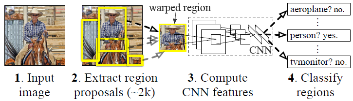
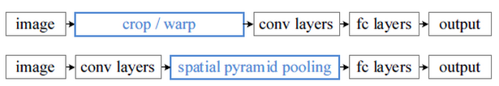
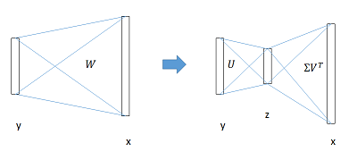
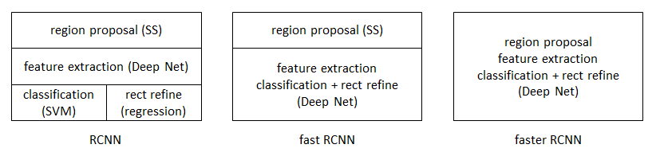
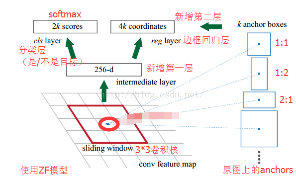

## 目标检测简介  

&emsp;&emsp;目标检测是计算机视觉的一个重要研究方向，是指从一个场景（或图片）中找到感兴趣的目标。任务大致分为三个流程：

* 从场景中提取候选区
* 从候选区提取特征
* 识别候选区的类别并对有效的候选框进行位置精修

&emsp;&emsp;目标检测在生活的各个领域都有了广泛的应用，它是将图像或视频中的目标与不感兴趣的部分区分开，判断是否存在目标，若存在目标则确定目标的位置。近年来，随着互联网技术、人工智能计算和智能硬件的迅猛发展，人类生活中存在着大量的图像和视频数据，这使得计算机视觉的研究也越来越火热。目标检测技术作为计算机视觉领域的一个重要组成部分，也受到了很大程度上的关注。目前在实际生活中的应用也十分广泛，包括目标跟踪，视频监控，信息安全，自动驾驶，图像检索，医学图像分析，网络数据挖掘，无人机导航，遥感信息分析，国防系统，以及机器人环境感知等。  
&emsp;&emsp;目标检测方法主要分为两大类：

* 基于传统图像处理和机器学习算法的目标检测方法
* 基于深度学习的目标检测方法

&emsp;&emsp;传统目标检测方法主要分为六个步骤，包括图像预处理，窗口滑动，特征提取，选择以及分类，和后处理这六个步骤。每个步骤所做的工作分别是：a)图像预处理是对检测图像进行图像的去噪声和增强，以及色彩转换等操作；b)窗口滑动是指在待测图像中滑动一个大小相同的窗口，将窗口中的子图像提取出来做候选区域；c)特征提取就是对候选区域使用特定的算法进行处理；d)特征选择即从上一步提取的特征向量中挑选出具有代表性的特征，降低特征的维数；e)特征分类就是利用特定的分类器对特征进行分类，判定候选区是否包含了目标及其类别；f)后处理是指合并判断为同一类别的相交候选区，计算出每个目标的边界框。  
&emsp;&emsp;传统目标检测方法的检测重点是在特征提取（如何提高特征的表达能力和抗形变能力）和特征分类（如何提高分类器的准确度和速度上）。由此，研究人员提出了多种形式的特征和分类器，其中，代表性的特征有代表性的特征有SIFT(scale-invariant feature transform)、Hear、HOG(histogram of oriented gradient)、Strip等；代表性的分类器有AdaBoost、SVM(support vector machine)、DPM(deformable parts model)、RF(random forest)等。  
&emsp;&emsp;但是，传统的目标检测方法的准确度并不能达到实际需求，其根本原因有两个，一个是使用滑动窗口的策略进行区域选择时针对性不强，提高了时间复杂度和窗口冗余，另一个是使用设计的特征。设计的特征存在以下三个缺点：a)设计的特征为低层特征，对目标的表达能力不足；b)设计的特征可分性差，导致分类的错误率较高；c)设计的特征具有针对性，很难选择单一特征应用于多目标检测，例如：Hear特征用于人脸检测，HOG特征用于行人检测，Stip特征用于车辆检测。  
&emsp;&emsp;随着计算机性能的不断提高，曾经难以实现的深度学习算法变得切实可行，目标检测开始进入深度学习时代。深度学习提取的特征为高层特征，相比于传统的目标检测方法的设计特征，学习的特征更加丰富，表达能力更强。而且深度学习将特征提取，特征选择以及特征分类融合到一个模型中，通过端对端的训练，从整体上进行功能优化，增加了特征的可分性。基于深度学习的目标检测算法大致可以分为三类：a)基于区域建议的目标检测算法：如R-CNN，Fast-RCNN，Faster-RCNN；b)基于回归的目标检测算法：如YOLO，SSD；c)基于搜索的目标检测算法，如基于视觉注意的AttentionNet，基于强化学习的算法。  

### 1 基于区域提名的深度学习目标检测算法

&emsp;&emsp;卷积神经网络（CNN）是区域提议（Region Propoal）算法的核心组成部分，卷积神经网络最早是有Yann LeCun教授提出来的，早期的卷积神经网络是用作分类器使用的，主要用于图像识别。卷积神经网络有三个结构上的特性：局部连接、权重共享以及空间和时间上的采样。这些特性使得卷积神经网络具有一定程度上的平移、缩放和扭曲不变性。在2006年Hinton提出使用深度神经网络从大量的数据中自动学习高层特征。区域建议在此基础上解决了传统目标检测方法存在的两个问题。比较常用的区域建议方法有Selective search和Edge boxes。此后，CNN网络迅速发展，微软最新的ResNet和谷歌的Inception V4模型的Top-5 error降到了4%以内，所以目标检测得到候选区域后使用CNN对其进行图像分类的准确率和检测速度上都有提高。这类算法的主要步骤是：

* 首先使用选择性搜索算法（Selective Serch）、Bing、EdgeBoxes这些目标候选区域生成算法生成一系列候选目标区域；
* 然后通过深度神经网络提取目标候选区域的特征；
* 最后用这些特征进行分类，以及目标真实边界的回归。

#### 1.1 R-CNN

&emsp;&emsp;R-CNN算法可以说是利用深度学习进行目标检测的开山之作，将深度学习引入了目标检测领域，一举将PASCAL VOC上的检测率从35.1%提升到53.7%。针对传统目标检测方法存在的两个问题，R-CNN都有了很好的解决方法：预先提前一系列可能是物体的候选区域，之后仅在这些候选区域上提取特征，进行判断，从而解决了传统目标检测方法利用滑动窗口依次判断所有可能的区域造成时间复杂度太高和窗口冗余的问题；训练深度网络来进行特征提取替代人工设定特征，解决了人工设定特征的三个缺点。
&emsp;&emsp;R-CNN的实现步骤主要有4个：

* a)首先用选择性搜索算法（selective Search）提取1k-2k个候选区域；
* b)使用深度卷积神经网络提取每一个候选区的深度特征；
* c)训练SVM分类器来对这些特征进行分类；
* d)最后通过边界回归算法程序定位目标边界框。

&emsp;&emsp;但是，由于在特征提取后进行分类的过程中有一个全连接层的操作，这一个操作要求提取特征的图片需要相同尺度的大小，提取的不合适的特征图片需要进行裁切（Crop）或者变形缩放（Warp），这在一定程度上造成图像畸形，影响最终结果。随后He等人提出SPP-NET缩放很好的解决了这一问题。

#### 1.2 SPP-NET

&emsp;&emsp;R-CNN存在的问题在SPP-NET解决主要在于SPP网络的提出，这一网络解决了R-CNN这一网络要求提取特征要求相同尺度的大小这一问题。下面是R-CNN和SPP-NET网络结构的对比。

&emsp;&emsp;R-CNN现在提取图片特征后先进行卷积后再进行全连接层的训练，而SPP-NET的网络在进行卷积之后再进行SPP操作，这一操作可以让网络输入任何大小的图片，都会生成固定大小的输出，整体的结构除了这一点以外和之前的R-CNN没有什么不同，因此在其它方面，SPP-NET存在和R-CNN一样的问题。

#### 1.3 Fast RCNN

&emsp;&emsp;在2015年，继提出R-CNN算法后，Ross Girshick提出了Faster RCNN，流程更为紧凑，大幅提升了目标检测的速度，同样使用最大规模的网络，Fast R-CNN和R-CNN相比，训练时间从84小时减少为9.5小时，测试时间从47秒减少为0.32秒。在PASCAL VOC 2007上的准确率相差无几，约在66%~67%之间。
&emsp;&emsp;Fast RCNN主要解决了R-CNN的三个问题：

* **测试速度慢**
  RCNN一张图片内候选框之间大量重叠，提取特征操作冗余。
  Fast RCNN将整张图像归一化后直接送入深度网络，在邻接时，才加入候选框信息，在末尾的少数几层处理每个候选框。

* **训练速度慢**
  原因同上
  在训练时，Fast RCNN先将一张图像送入网络，紧接着送入从这幅图像上提取出的候选区域。这些候选区域的前几层特征不需要再重复计算。

* **训练所需空间大**
  RCNN中独立的分类器和回归器需要大量特征作为训练样本。
  Fast RCNN把类别判断和位置精确统一用深度网络实现，不再需要额外存储。

&emsp;&emsp;其中，Fast RCNN最大的贡献是全连接层的提速。
&emsp;&emsp;分类和位置调整都是通过全连接层（fc）实现的，设前一级数据为x后一级数据为y，全连接层参数为w，尺寸为$u*v$。一次前向传播（forward）即为：$$y = Wx$$
    计算复杂度为$u*v$。
    将W进行SVD分解，并用前t个特征值近似$$W=U\Sigma   V^T\approx U(:,1:t)\cdot \Sigma  (1:t,1:t)\cdot V(:,1:t)^T$$
    原来的前向传播分解为两步：$$y = Wx = U\cdot (\Sigma   \cdot V^T)\cdot x = U\cdot z$$
    计算复杂度变为$u\times t+v\times t$。
    在实现时，相当于把一个全连接层拆分为两个，中间以一个低维数据相连。

    其实验结果为：

    * 网络末端同步训练的分类和位置调整，提升准确度；
    * 使用多尺度的图像金字塔，性能几乎没有提高；
    * 倍增训练数据，能够有2%~3%的准确度提升；
    * 网络直接输出各类概率（softmax），比SVM分类器性能略好；
    * 更多候选窗不能提升性能。

#### 1.4 Faster R-CNN

&emsp;&emsp;同在2015年，Ross Girshick团队提出了Faster R-CNN，简单网络的目标检测速度达到17fps，在PASCAL VOC上准确率为59.9%；复杂网络达到5fps，准确率78.8%。
&emsp;&emsp;从RCNN到Fast RCNN，再到Faster R-CNN，目标检测的四个基本步骤（候选区域生成，特征提取，分类，位置精修）终于被统一到一个深度网络框架之内。所有计算没有重复，完全在GPU中完成，大大提高了运行速度。

&emsp;&emsp;Faster RCNN可以简单地看做”区域生成网络+Fast R-CNN“的系统，用区域生成网络代替Fast R-CNN中的Selective Search方法。Faster R-CNN着重解决了这个系统中的三个问题：

    1.如何设计区域生成网络
    2.如何训练区域生成网络
    3.如何让区域生成网络和Fast RCNN网络共享特征提取网络
&emsp;&emsp;Faster R-CNN提出了区域生成网络RPN，快速生成候选区域；通过交替训练，使RPN和Fast RCNN网络共享参数。

### 2 基于回归的目标检测算法

&emsp;&emsp;虽然Faster R-CNN是目前主流的目标检测算法之一，但是速度上并不能满足实时的要求，随后出现YOLO，SSD这一类的算法逐渐凸显出其优略性，这类方法充分地利用了回归的思想，直接在原始图像的多个位置回归，判别出目标边框以及目标类别。

#### 2.1 YOLO

&emsp;&emsp;2016年Redmon等人提出的YOLO算法是一个可以一次性预测多个Box位置和类别的卷积神经网络，YOLO算法的网络设计延续了GoogleNet的核心思想，真正意思上实现了端到端的目标检测，并且发挥了速度快的优势，但其精度有所下滑。但在同年Redmon等人在YOLO的基础上提出了YOLO9000算法，保持了YOLO的速度，提高了准确度。主要有两方面的改进：1)在原先的YOLO检测框架上进行一系列的改进，弥补了检测精度的不足；2)提出了目标检测和目标训练和二为一的方法。YOLOv2算法的训练网络采用降采样的方法在特定的情况下可以进行动态调整，这种机制可以使网络预测不同大小的图片，让检测速度和精度之间达到平衡。

#### 2.2 SSD

&emsp;&emsp;2016年Liu等人提出SSD算法，该算法结合YOLO的回归思想以及Faster R-CNN的anchor机制做到了速度和准确率并存。最初的YOLO算法是在7x77x7的框架下识别物体，用这种框架检测小物体时，准确率会下降。在SSD算法中去掉了YOLO算法的全连接层，所以对任意大小的物体都可以检测，性能基本不变。对SSD的测试集进行训练和训练使用候选区域及用来池化的标准测试器之间最大的不同之处在于，ground truth 需要被赋予一组固定集合检测输出中某一个特定输出。当这个赋值确定之后，损失函数和后向传播就能够实现端到端的应用。总之，SSD结合了YOLO中的回归思想和Faster R-CNN中的anchor机制，使用全图各个位置的多尺度区域特征进行回归，既保持了YOLO速度快的特性，也保证了窗口预测跟Faster R-CNN一样精准。
