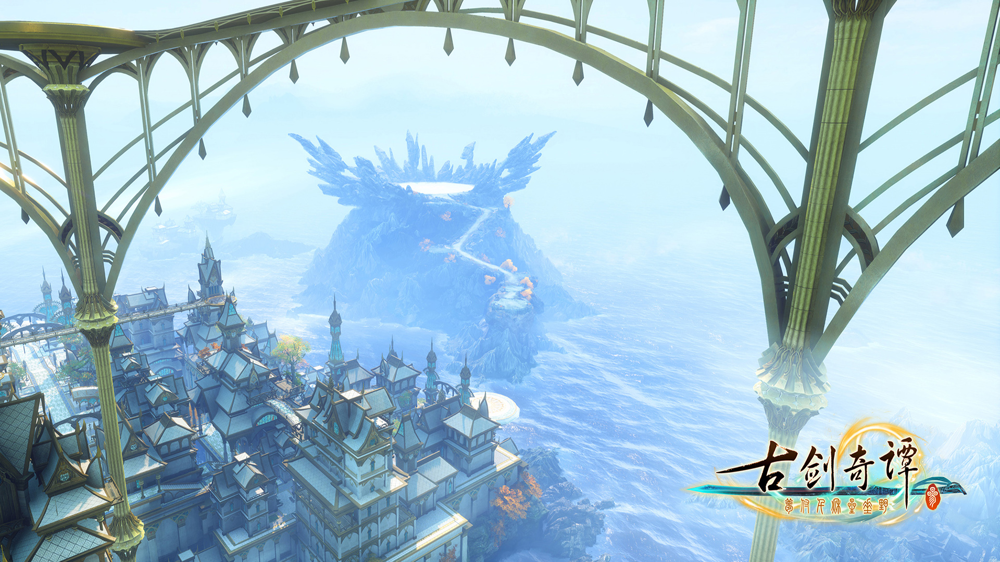

培养专注的习惯，学会独立思考

## 1 [学习AI需要哪些技能](https://zhuanlan.zhihu.com/p/52814848)  

* 1.编程基础  
  * 熟练使用linux，git，vim等环境和工具。  
  * 熟练掌握 C/C++、Python等编程语言。  
  * 熟练掌握cmake，g++等编译工具。  
  
* 2.算法基础  
  * 熟悉传统图像算法，机器学习算法。  
  * 熟练跟踪并阅读行业前沿研究，复现结果。
  * 系统性熟悉深度学习理论。

* 3.框架基础  
  * 熟练掌握 Caffe、TensorFlow、pytorch等以及不断新出的开源平台。  

* 4.其它基础
  * 掌握爬虫等前后端的基础知识。  
  * 了解并熟悉Cuda等GPU编程技术，了解一些移动端的硬件知识。  
  * 了解并熟悉 Android、iOS 等移动端的基础知识，在项目中可能会需要使用。  

## 2 吴恩达深度学习课后作业  

[吴恩达深度学习视频](https://mooc.study.163.com/learn/2001281002?tid=2001392029#/learn/content)  
[作业参考](https://blog.csdn.net/u013733326/article/details/79827273)

### 2.1 神经网络和深度学习  

#### 2.1.1 logistic回归

[作业代码](https://github.com/JiangChenrui/DeeplingAI/tree/master/DeeplingAI_course1/week2_Logistic)  

#### 2.1.2 浅层神经网络  

[作业代码](https://github.com/JiangChenrui/DeeplingAI/tree/master/DeeplingAI_course1/week3_simple_net)  

#### 2.1.3 深层神经网络  

[作业代码](https://github.com/JiangChenrui/DeeplingAI/tree/master/DeeplingAI_course1/week4_complex_net)

### 2.2 改善深层神经网络  

#### 2.2.1 深度学习的实用层面  

## 3 cs231n课程笔记  

### 3.1 [图像处理的一些简单方法](https://github.com/JiangChenrui/matching_learning_note/blob/master/image_enhance.py)  

```python
from PIL import Image
from PIL import ImageEnhance
import matplotlib.pyplot as plt

# 原始图像
image = Image.open('match_learning/picture/1.jpg')  # 打开图片
# image.show()
plt.figure("origan_image")
plt.imshow(image)
plt.show()
```

  

```python
# 亮度增强
enh_bri = ImageEnhance.Brightness(image)
brightness = 1.5
image_brightened = enh_bri.enhance(brightness)
# image_brightened.show()
plt.figure("brightened")
plt.imshow(image_brightened)
plt.show()
image_brightened.save('match_learning/picture/image_brightened.jpg')
```

  

```python
# 色度增强
enh_col = ImageEnhance.Color(image)
color = 1.5
image_colored = enh_col.enhance(color)
# image_colored.show()
plt.figure("colored")
plt.imshow(image_colored)
plt.show()
image_colored.save('match_learning/picture/image_colored.jpg')
```

  

```python
# 对比度增强
enh_con = ImageEnhance.Contrast(image)
contrast = 1.5
image_contrasted = enh_con.enhance(contrast)
# image_contrasted.show()
plt.figure("contrast")
plt.imshow(image_contrasted)
plt.show()
image_contrasted.save('match_learning/picture/image_contrasted.jpg')
```


```python
# 锐度增强
enh_sha = ImageEnhance.Sharpness(image)
sharpness = 1.5
image_sharped = enh_sha.enhance(sharpness)
# image_sharped.show()
plt.figure("sharpness")
plt.imshow(image_sharped)
plt.show()
image_sharped.save('match_learning/picture/image_sharped.jpg')

```

  

### 3.2 [python学习笔记](https://github.com/JiangChenrui/DeeplingAI/blob/master/cs231n/python_study.py)  
