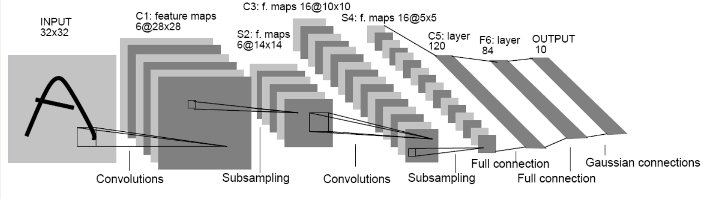
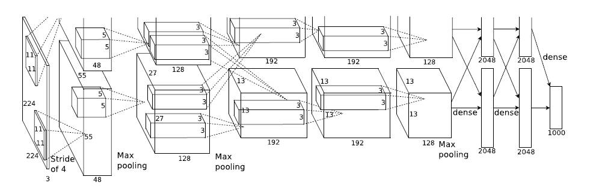
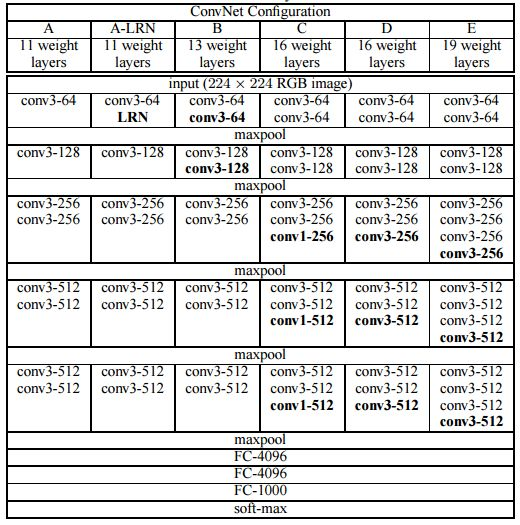

本文收集了一些神经网络的架构，包含常用的一些模型。  

## LeNet5  

  
1.Input  
&emsp;&emsp;输入图像统一归一化为32\*32。  
2.C1卷积层  
&emsp;&emsp;经过(5\*5\*1)\*6卷积核，stride=1, 生成featuremap为28\*28\*6。  
3.S2池化层  
&emsp;&emsp;经过(2\*2)采样核，stride=2，生成featuremap为14\*14\*6。  
4.C3卷积层  
&emsp;&emsp;经过(5\*5\*6)\*16卷积核，stride=1，生成featuremap为10\*10\*16。  
5.S4池化层  
&emsp;&emsp;经过(2\*2)采样核，stride=2，生成featuremap为5\*5\*16。  
6.C5卷积层  
&emsp;&emsp;经过(5\*5\*16)\*120卷积核，stride=1， 生成featuremap为1\*1\*120。  
7.F6全连接层  
&emsp;&emsp;输入为1\*1\*120，输出为1\*1\*84，总参数量为120\*84。  
8.Output全连接层。  
&emsp;&emsp;输入为1\*1\*84，输出为1\*1\*10，总参数量为84\*10。10就是分类的类别数。  

## AlexNet  

  
1.Input  
&emsp;&emsp;输入图像为227\*227\*3。  
2.Conv1  
&emsp;&emsp;经过(11\*11\*3)\*96卷积核，stride=4， (227-11)/4+1=55，生成featuremap为55\*55\*96。  
3.Pool1  
&emsp;&emsp;经过3\*3的池化核，stride=2，(55-3)/2+1=27，生成featuremap为27\*27\*96。  
4.Norm1  
&emsp;&emsp;local_size=5，生成featuremap为27\*27\*96。  
5.Conv2  
&emsp;&emsp;经过(5\*5\*96)\*256的卷积核，pad=2，group=2，(27+2\*2-5)/1+1=27，生成featuremap为27\*27\*256。  
6.Pool2  
&emsp;&emsp;经过3\*3的池化核，stride=2，(27-3)/2+1=13，生成featuremap为13\*13\*256。  
7.Norm2  
&emsp;&emsp;local_size=5, 生成featuremap为13\*13\*256。  
8.Conv3  
&emsp;&emsp;经过(3\*3\*256)\*384卷积核，pad=1， (13+1\*2-3)/1+1=13，生成featuremap为13\*13\*384。  
9.Conv4  
&emsp;&emsp;经过(3\*3\*384)\*384卷积核，pad=1，(13+1\*2-3)/1+1=13，生成featuremap为13\*13\*384。  
10.Conv5  
&emsp;&emsp;经过(3\*3\*384)\*256卷积核，pad=1，(13+1\*2-3)/1+1=13，生成featuremap为13\*13\*256。  
11.Pool5  
&emsp;&emsp;经过(3\*3)的池化核，stride=2，(13-3)/2+1=6，生成featuremap为6\*6\*256。  
12.Fc6  
&emsp;&emsp;输入为(6\*6\*256)\*4096全连接，生成featuremap为1\*1\*4096。  
13.Dropout6  
&emsp;&emsp;在训练的时候以1/2概率使得隐藏层的某些神经元的输出为0，这样就丢掉了一半节点的输出，BP的时候也不更新这些节点，以下Droupout同理。  
14.Fc7  
&emsp;&emsp;输入为1\*1\*4096，输出为1\*1\*4096，总参数量为4096\*4096。  
15.Dropout7  
&emsp;&emsp;生成featuremap为1\*1\*4096。  
16.Fc8  
&emsp;&emsp;输入为1\*1\*4096，输出为1000，总参数量为4096\*1000。  

**总结:**

**1.网络比LeNet更深，包括5个卷积层和3个全连接层。**  
**2.使用relu激活函数，收敛很快，解决了Sigmoid在网络较深时出现的梯度弥散问题。**  
**3.加入了dropout层，防止过拟合。**  
**4.使用了LRN归一化层，对局部神经元的活动创建竞争机制，抑制反馈较小的神经元放大反应大的神经元，增强了模型的泛化能力。**  
**5.使用裁剪翻转等操作做数据增强，增强了模型的泛化能力。预测时使用提取图片四个角加中间五个位置并进行左右翻转一共十幅图片的方法求取平均值，这也是后面刷比赛的基本使用技巧。**  
**6.分块训练，当年的GPU没有这么强大，Alexnet创新地将图像分为上下两块分别训练，然后在全连接层合并在一起。**  
**7.总体的数据参数大概为240M。**  

## VGG  

  

1.Input层  
&emsp;&emsp;输入图片为224\*224\*3。  
2.CONV3-64  
&emsp;&emsp;经过（3\*3\*3）\*64卷积核，生成featuremap为224\*224\*64。  
3.CONV3-64  
&emsp;&emsp;经过（3\*3\*64）\*64卷积核，生成featuremap为224\*224\*64。  
4.Max pool  
&emsp;&emsp;经过（2\*2）max pool核，生成featuremap为112\*112\*64。  
5.CONV3-128。  
&emsp;&emsp;经过（3\*3\*64）\*128卷积核，生成featuremap为112\*112\*128。  
6.CONV3-128  
&emsp;&emsp; 经过（3\*3\*128）\*128卷积，生成featuremap为112\*112\*128。  
7.Max pool  
&emsp;&emsp;经过（2\*2）maxpool，生成featuremap为56\*56\*128。  
8.CONV3-256  
&emsp;&emsp;经过（3\*3\*128）\*256卷积核，生成featuremap为56\*56\*256。  
9.CONV3-256  
&emsp;&emsp;经过（3\*3\*256）\*256卷积核，生成featuremap为56\*56\*256。  
10.CONV3-256  
&emsp;&emsp;经过（3\*3\*256）\*256卷积核，生成featuremap为56\*56\*256。
11.Max pool  
&emsp;&emsp;经过（2\*2）maxpool，生成featuremap为28\*28\*256。  
12.CONV3-512  
&emsp;&emsp;经过（3\*3\*256）\*512卷积核，生成featuremap为28\*28\*512。  
13.CONV3-512  
&emsp;&emsp;经过（3\*3\*512）\*512卷积核，生成featuremap为28\*28\*512。  
14.CONV3-512  
&emsp;&emsp;经过（3\*3\*512）\*512卷积核，生成featuremap为28\*28\*512。  
15.Max pool  
&emsp;&emsp;经过（2\*2）maxpool,生成featuremap为14\*14\*512。  
16.CONV3-512  
&emsp;&emsp;经过（3\*3\*512）\*512卷积核，生成featuremap为14\*14\*512。  
17.CONV3-512  
&emsp;&emsp;经过（3\*3\*512）\*512卷积核，生成featuremap为14\*14\*512。  
18.CONV3-512
&emsp;&emsp;经过（3\*3\*512）\*512卷积核，生成featuremap为14\*14\*512。  
19.Max pool  
&emsp;&emsp;经过2\*2卷积，生成featuremap为7\*7\*512。  
20.FC-4096  
&emsp;&emsp;输入为7\*7\*512，输出为1\*1\*4096，总参数量为7\*7\*512\*4096。  
21.FC-4096  
&emsp;&emsp;输入为1\*1\*4096，输出为1\*1\*4096，总参数量为4096\*4096。  
22.FC-1000  
&emsp;&emsp;输入为1\*1\*4096，输出为1000，总参数量为4096\*1000。  

**总结:**  

**1. 共包含参数约为550M。**  
**2. 全部使用3\*3的卷积核和2\*2的最大池化核。**  
**3. 简化了卷积神经网络的结构。**  

[MobileNet](https://blog.csdn.net/u011974639/article/details/79199306)  