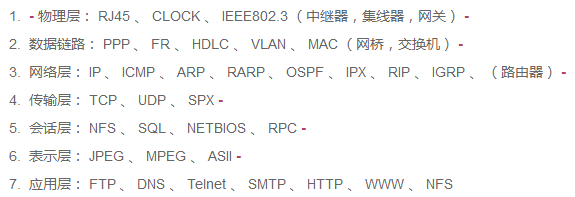

[GItHub使用指南](https://blog.csdn.net/Hanani_Jia/article/details/77950594)  
[GitHub 编辑指导](https://blog.csdn.net/ljc_563812704/article/details/53464039)  
[GItHub 公式编辑](https://www.jianshu.com/p/fd97e1f8f699)  
[Markdown 教程](https://hacpai.com/guide/markdown)

## 程序员四大件

- 数据结构与算法
- 操作系统
- 计算机网络
- 设计模式

## 操作系统

### [进程和线程的区别](https://blog.csdn.net/ThinkWon/article/details/102021274#t3)

1. **根本区别：** 进程是资源调度的基本单位，线程是CPU调度和执行的基本单位。
2. **资源开销：** 每个进程都有独立的代码和数据空间（程序上下文），程序之间的切换会有较大的开销；线程可以看做轻量级的进程，同一类线程共享代码和数据空间，每个线程都有自己独立的运行栈（保证线程中的局部变量不被别的线程访问到）和程序计数器（为了线程切换后能恢复到正确的执行位置），线程之间切换的开销小。
3. **包含关系：** 如果一个进程内有多个线程，则执行过程不是一条线的，而是多条线（线程）共同完成的；线程是进程的一部分，所以线程也被称为轻权进程或者轻量级进程。
4. **内存分配：** 同一进程的线程共享本进程的地址空间和资源，而进程之间的地址空间和资源是相互独立的。
5. **影响关系：** 一个进程崩溃后，在保护模式下不会对其他进程产生影响，但是一个线程崩溃整个进程都死掉。所以多进程比多线程健壮。
6. **执行过程：** 每个独立的进程有程序运行的入口、顺序指向序列和程序出口。但是线程不能独立执行，必须依存在应用程序中，有应用程序提供多个线程指向控制，两者均可并发执行。

[多进程和多线程的区别](https://blog.csdn.net/linraise/article/details/12979473)

| 纬度　| 多进程 | 多线程　|　总结　|
| ------- | ------- | ------- | ------- |
| 数据共享、同步　| 数据是分开的：共享复杂，需要用IPC；同步简单 | 多线程共享进程数据：共享简单；同步复杂 | 各有优势 |
| 内存、CPU | 占用内存多，切换复杂，CPU利用率第 | 占用内存少，切换简单，CPU利用率高 | 线程占优 |
| 创建销毁、切换 | 创建销毁、切换复杂，速度慢 | 创建销毁、切换简单，速度快 | 线程占优 |
| 编程调试 | 编程简单，调试简单 | 编程复杂，调试复杂 | 进程占优 |
| 可靠性 | 进程之间不会相互影响 | 一个线程挂掉将导致整个进程挂掉 | 进程占优 |
| 分布式 | 适应于多核、多机分布；如果一台机器不够，扩展到多台机器比较简单 | 适应于多核分布 | 进程占优 |

### [并发与并行](https://blog.csdn.net/qq_33290787/article/details/51790605)

1. 并发的实质是一个物理CPU（也可以多个物理CPU）在若干道程序（或线程）之间多路复用，并发性是对有限物理资源强行限制使多用户共享以提高效率。
2. 并行指两个或两个以上的事件（或线程）在同一时刻发生，是真正意义上的不同事件或线程在同一时刻，在不同CPU资源上（多核）同时执行。

## 数据结构和算法问题

### [堆和栈的区别](https://blog.csdn.net/hairetz/article/details/4141043)  

## 计算机网络

[TCP/IP协议](https://zhuanlan.zhihu.com/p/147370653)

## 计算机视觉面试问题  

### [SVM](https://blog.csdn.net/v_july_v/article/details/7624837)  

### [CNN](https://blog.csdn.net/fengbingchun/article/details/50529500)  

[常见网络收集](https://blog.csdn.net/weixin_42111770/article/details/80719302)  

### [softmax函数](https://blog.csdn.net/u014380165/article/details/77284921)  

### [attention](https://blog.csdn.net/guohao_zhang/article/details/79540014)  

### data augmentation  

### 损失函数

#### 随机梯度下降

#### [交叉熵](https://blog.csdn.net/rtygbwwwerr/article/details/50778098)  

### [正则化](https://blog.csdn.net/kyang624823/article/details/78646234)  

### [泰勒公式](https://charlesliuyx.github.io/2018/02/16/%E3%80%90%E7%9B%B4%E8%A7%82%E8%AF%A6%E8%A7%A3%E3%80%91%E6%B3%B0%E5%8B%92%E7%BA%A7%E6%95%B0/)  

### [Batch Normalization](https://blog.csdn.net/qq_25737169/article/details/79048516)  

### 网络参数是如何计算的  

### [ShuffleNet](https://blog.csdn.net/u011974639/article/details/79200559)  

### [deepwise separable conv](https://yinguobing.com/separable-convolution/#fn2)  

### [最优化方法](http://www.cnblogs.com/maybe2030/p/4751804.html#_label0)  

### [深度神经网络全面概述：从基本概念到实际模型和硬件基础](https://cloud.tencent.com/developer/article/1116764)  

### [数学概念](https://blog.csdn.net/majinlei121/article/details/47260917)  

### [RNN](https://blog.csdn.net/heyongluoyao8/article/details/48636251)  

### [LSTM](https://blog.csdn.net/gzj_1101/article/details/79376798)  

### [RPN](https://blog.csdn.net/sloanqin/article/details/51545125)  

### PCA  

### K-means

基本流程：
1. 初始化k个聚类中心$c_1$, $c_2$,...,$c_k$
2. 对于每个样本$x_i$和每个聚类中心$c_j$，计算样本和聚类中心之间的距离$d_ij$
3. 对于每个样本$x_i$，基于最小的$d_ij$把其分配到第$j$个类$C_j$
4. 对于每个类$C_j$，计算其所有样本的均值作为新的聚类中心，重复步骤2和步骤3直至样本点所属的类不再变化或达到最大迭代次数 

### KNN

基本流程：
1. 计算测试数据与各个训练数据之间的距离
2. 按照距离的递增关系进行排序
3. 选取距离最小的K个点
4. 确定前K个点所在类别的出现概率
5. 返回前K个点中出现频率最高的类别作为测试数据的预测分类

### K-means和KNN的区别

- K-means是无监督学习算法，KNN是有监督学习算法
- K-means是聚类算法，KNN是分类算法
- K-means有明显的训练过程（求聚类中心），KNN在学习阶段只是简单的吧所有样本记录
- 在测试阶段，对于K-means，新的样本点的判别与聚类中心有关，即与所有训练样本有关，对于KNN，新的样本点的判别只是与最近相邻的K个样本有关

### [损失函数](https://blog.csdn.net/kangyi411/article/details/78969642)  

### [梯度消失和梯度爆炸](https://blog.csdn.net/qq_25737169/article/details/78847691)

解决方法：
1. 预训练加微调
2. 梯度剪切、正则
3. 使用relu、leakrelu、elu等激活函数
4. batchnorm
5. 残差结构
6. LSTM

### SITF  

### Dropout  

### Pooling  

### [正则化](https://charlesliuyx.github.io/2017/10/03/%E3%80%90%E7%9B%B4%E8%A7%82%E8%AF%A6%E8%A7%A3%E3%80%91%E4%BB%80%E4%B9%88%E6%98%AF%E6%AD%A3%E5%88%99%E5%8C%96/#Why-amp-What-%E6%AD%A3%E5%88%99%E5%8C%96)  

## [计算机视觉及深度学习岗位应聘问题](https://blog.csdn.net/ferriswym/article/details/81331191)
